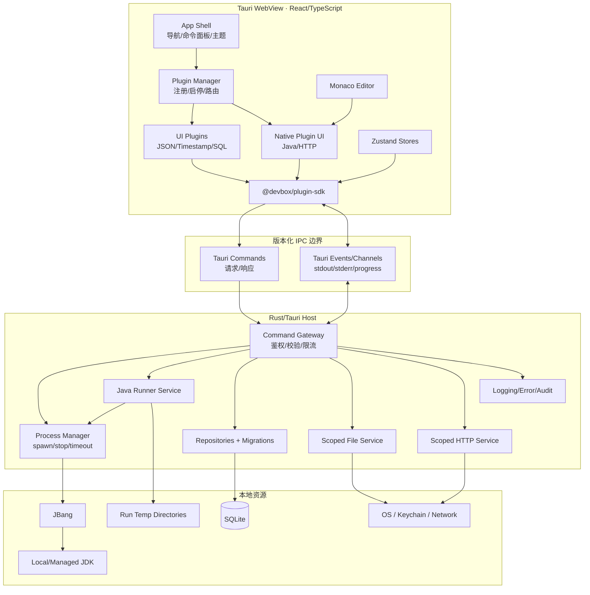
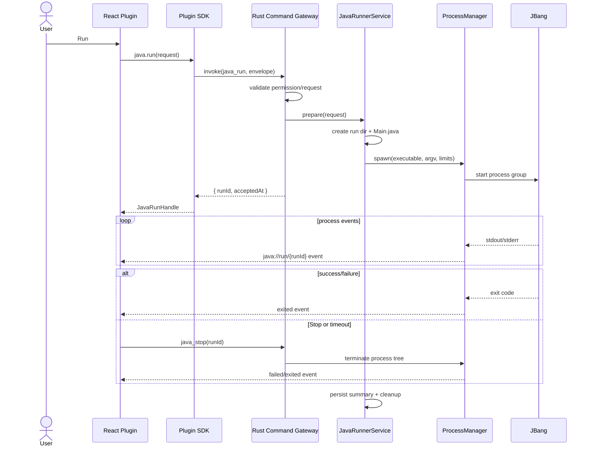

# DevBox 跨平台个人开发工具箱——技术架构设计

> 文档状态：架构基线（可用于 MVP 立项）  
> 目标平台：Windows / macOS / Linux  
> 核心栈：Tauri 2、React、TypeScript、Vite、Rust、JBang、本地 JDK、SQLite

## 0. 摘要与关键决策

DevBox 定位为一个**本地优先、插件化、具备受控系统能力的个人开发工具平台**。它既覆盖 JSON、时间戳、SQL 格式化等纯前端工具，也支持 Java、Git、Docker、数据库等需要文件、网络或子进程能力的工具。

核心决策如下：

1. 桌面容器采用 Tauri 2，界面采用 React + TypeScript + Vite。
2. Rust Host 是唯一的系统能力边界；WebView 中的代码不能直接启动任意命令或任意访问文件。
3. MVP 的插件采用“内置插件 + 静态注册”，但从第一天遵循统一的 manifest、接口和生命周期。
4. 外部插件优先采用受限的声明式/沙箱化 UI 扩展；不把第三方 JavaScript 直接注入主 WebView，也不动态加载第三方 Rust 动态库。
5. Java Runner 由 Rust Host 管理 JBang/本地 JDK 子进程，使用 `runId` 关联输出、停止、超时和历史记录。
6. SQLite 只保存结构化元数据；代码片段、运行历史、设置等通过 Repository 层访问，业务组件不直接拼 SQL。
7. 所有高风险能力遵循最小权限、参数化接口、明确授权、可追踪审计四个原则。

## 1. 项目目标与设计原则

### 1.1 项目目标

- 提供统一、快速、键盘友好的个人开发工具入口。
- 支持纯 UI 工具和需要原生能力的工具。
- 允许 DevBox 自身和插件独立演进，降低添加工具的成本。
- 为 Java/Spring 日常工作提供高质量 Java Playground：执行单文件、声明 Maven 依赖、选择 JDK、查看流式输出、终止运行。
- 在三个桌面平台保持一致的数据模型和使用体验，同时允许少量平台差异。
- 本地数据默认不离开设备；敏感信息不以明文进入日志或普通配置表。

### 1.2 非目标

- MVP 不做完整 IDE，不实现 Java Language Server、调试器或 Maven/Gradle 全工程构建。
- MVP 不做公开插件商店、在线账户和云同步。
- 不承诺运行不受信任代码的强沙箱；Java Runner 是开发者本机代码执行器，不是在线判题沙箱。
- 不允许插件获得“任意 shell”这种无法审计的宽泛能力。

### 1.3 设计原则

| 原则 | 落地方式 |
|---|---|
| 本地优先 | SQLite、本地插件目录、本地运行时；联网功能显式声明 |
| 最小权限 | 插件 manifest 声明权限，Host 再按参数与资源范围校验 |
| 契约优先 | UI 与 Host、Core 与插件之间都使用版本化 DTO/API |
| 可取消、可观测 | 长任务拥有 `runId`，支持事件流、取消、超时和结构化日志 |
| 渐进式插件化 | MVP 静态内置插件；稳定 API 后再开放外部插件 |
| 可迁移 | SQLite migration、manifest schemaVersion、Plugin API version |
| 故障隔离 | 单个插件错误由 Error Boundary 隔离；子进程独立管理 |
| 简化分发 | MVP 优先依赖系统 JDK/JBang；可选的受控安装独立演进 |

## 2. 总体架构



运行时的信任边界是 WebView 与 Rust Core 之间的 IPC。Tauri 的 capability 用于限制窗口可调用的能力，但 DevBox 仍需在 command 内实施插件级权限校验，因为多个插件共享主窗口时，窗口级 capability 不能自动等价为插件级隔离。

## 3. 前后端职责边界

### 3.1 React/TypeScript 负责

- App Shell、布局、路由、命令面板、快捷键和主题。
- 国际化基础设施、语言切换、翻译资源加载和日期/数字/时区的本地化展示。
- 插件注册、可见性、排序、启停状态和 UI 生命周期。
- 表单校验中的即时反馈，但不能替代 Host 的安全校验。
- Monaco model、tab、编辑状态和本地交互。
- 展示流式输出、任务状态和错误；不持有 OS 子进程句柄。
- JSON、Base64、时间戳等无特权计算。

### 3.2 Rust/Tauri Host 负责

- 文件、进程、网络、密钥、SQLite 等特权能力。
- 对 IPC DTO 反序列化、长度/格式/范围校验和权限判断。
- JDK/JBang 探测、Java 临时工作区、子进程生命周期。
- 对 stdout/stderr 做有界缓冲与事件转发，避免 UI 或内存被淹没。
- 数据迁移、事务和数据完整性。
- 日志脱敏、审计和稳定错误码。

### 3.3 明确禁止的边界穿透

- React 不直接使用通用 shell API 拼接命令字符串。
- 插件不获得数据库连接对象，只获得按领域封装的 Storage API。
- 插件不传任意路径让 Host 读写；使用用户选择的 scope token 或 DevBox 管理目录。
- UI 不依据插件提交的 `pluginId` 作为可信身份；Host 需要校验调用上下文和授权记录。

## 4. 推荐目录结构

```text
devbox/
├─ apps/
│  └─ desktop/
│     ├─ src/
│     │  ├─ app/                    # App Shell、router、providers
│     │  ├─ components/             # DevBox 通用组件
│     │  ├─ features/               # settings、plugin-manager、command-palette
│     │  ├─ i18n/                   # i18next 初始化、语言检测、locale 资源
│     │  ├─ stores/                 # Zustand stores
│     │  ├─ ipc/                    # invoke 封装、DTO、event client
│     │  ├─ plugins.generated.ts    # 构建期生成的内置插件注册表
│     │  └─ main.tsx
│     ├─ src-tauri/
│     │  ├─ capabilities/           # Tauri capability 定义
│     │  ├─ migrations/             # SQLite migrations
│     │  ├─ src/
│     │  │  ├─ commands/            # 窄而稳定的 IPC commands
│     │  │  ├─ domain/              # 实体、错误、策略
│     │  │  ├─ services/            # java/process/fs/http/plugin
│     │  │  ├─ repositories/        # SQLite 持久化
│     │  │  ├─ security/            # 权限、scope、脱敏
│     │  │  ├─ telemetry/           # 本地日志与审计
│     │  │  ├─ state.rs             # AppState
│     │  │  └─ lib.rs
│     │  ├─ binaries/               # 可选 sidecar，带 target triple
│     │  ├─ Cargo.toml
│     │  └─ tauri.conf.json
│     ├─ package.json
│     └─ vite.config.ts
├─ packages/
│  ├─ plugin-sdk/                   # 稳定公共 TS API；无业务实现
│  ├─ ipc-contracts/                # DTO、错误码、运行事件类型
│  ├─ ui/                           # Tailwind/shadcn/ui 二次封装
│  ├─ config/                       # tsconfig/eslint/prettier 共享配置
│  └─ test-utils/
├─ plugins/
│  ├─ json-tool/
│  ├─ timestamp-tool/
│  ├─ java-runner/
│  ├─ sql-tool/
│  └─ http-client/
│     ├─ src/
│     ├─ plugin.json
│     ├─ package.json
│     └─ tests/
├─ schemas/
│  └─ plugin-manifest.schema.json
├─ scripts/                         # manifest 校验、注册表生成、打包
├─ docs/
├─ pnpm-workspace.yaml
├─ Cargo.toml                       # 可选 Rust workspace
└─ package.json
```

推荐 pnpm workspace 管理 TypeScript monorepo，Rust 保持一个主 crate，直到 Host 复杂度足以拆为 workspace crates。内置插件可以独立包开发，但产物随桌面应用构建，避免 MVP 引入运行时模块联邦。

## 5. 插件系统总体设计

### 5.1 概念模型

- **PluginDescriptor**：从 manifest 解析出的不可变描述。
- **PluginModule**：插件导出的 UI 模块，含 `activate` 和可选 `deactivate`。
- **PluginInstance**：某次启动中的状态，包含 granted permissions、disposables 和运行状态。
- **PluginContext**：Core 注入的上下文；插件不能自行构造。
- **PluginAPI**：按权限裁剪后的能力集合。
- **Contribution**：插件向 Core 注册的页面、命令、设置、快捷键等扩展点。

### 5.2 扩展点

首批只开放以下扩展点：

| 扩展点 | 用途 | 注册方式 |
|---|---|---|
| `views` | 左侧工具页面 | manifest 声明 + 组件映射 |
| `commands` | 命令面板动作 | manifest 声明 + handler 注册 |
| `settings` | 插件配置页 | JSON schema + UI schema |
| `keybindings` | 默认快捷键 | manifest 声明，可由用户覆盖 |
| `statusItems` | 状态栏信息 | 运行时注册，有严格数量限制 |

不在初期开放任意菜单 DOM 注入、Host command 注册、原生动态库和后台常驻任务。

### 5.3 插件状态机

```text
discovered → validated → compatible → loaded → activating → active
     │           │            │          │          │          │
     └────────── disabled / rejected / failed ───────┘          │
                                                               ↓
                                      deactivating → inactive/unloaded
```

manifest 验证、兼容性检查和权限授权均通过后才能加载。任何阶段失败都产生稳定错误码，且不阻止 Core 和其他插件启动。

## 6. `plugin.json` Manifest 规范

### 6.1 完整字段

```ts
interface PluginManifest {
  schemaVersion: 1;
  id: string;                         // 反向域名式，发布后不可变
  name: string;
  version: string;                    // SemVer
  description: string;
  publisher: string;
  license?: string;
  homepage?: string;
  repository?: string;
  icon?: string;                      // 包内相对路径，不允许 URL
  categories: PluginCategory[];
  keywords?: string[];

  engines: {
    devbox: string;                   // SemVer range，如 ^1.0.0
    pluginApi: string;                // 如 ^1.0.0
  };

  type: "ui" | "native";
  entry: string;                      // 包内相对 ESM 入口
  activationEvents: ActivationEvent[];
  permissions: PluginPermission[];
  contributes?: {
    views?: ViewContribution[];
    commands?: CommandContribution[];
    settings?: SettingsContribution;
    keybindings?: KeybindingContribution[];
  };

  platforms?: Array<"windows" | "macos" | "linux">;
  integrity?: {
    algorithm: "sha256";
    files: Record<string, string>;
  };
  signature?: {
    algorithm: "ed25519";
    keyId: string;
    value: string;
  };
}
```

推荐的约束：

- `id`：`^[a-z0-9][a-z0-9.-]{2,127}$`，例如 `devbox.builtin.java-runner`。
- `entry`、`icon`：规范化后必须仍位于插件根目录；拒绝绝对路径与 `..` 逃逸。
- 所有数组设长度上限；所有展示文本设字符上限。
- 未知顶层字段默认拒绝，避免拼写错误悄悄失效；可扩展数据放入命名空间明确的字段。
- 安装前验证 JSON Schema、文件哈希、签名、引擎版本和平台兼容性。

### 6.2 权限类型

```ts
type PluginPermission =
  | { name: "storage.plugin"; quotaMb?: number }
  | { name: "clipboard.read" }
  | { name: "clipboard.write" }
  | { name: "dialog.openFile"; extensions?: string[]; multiple?: boolean }
  | { name: "dialog.saveFile"; extensions?: string[] }
  | { name: "fs.read"; scopes: Array<"user-selected" | "plugin-data"> }
  | { name: "fs.write"; scopes: Array<"user-selected" | "plugin-data"> }
  | { name: "network.http"; hosts: string[]; methods?: HttpMethod[] }
  | { name: "process.java" }
  | { name: "secrets.read"; keys: string[] }
  | { name: "secrets.write"; keys: string[] };
```

`process.shell` 不进入公共权限集合。未来 Git、Docker、ADB 等功能应各自拥有参数化的 `process.git`、`process.docker` 能力，而不是复用通用 shell。

### 6.3 Java Runner 示例

```json
{
  "$schema": "../../schemas/plugin-manifest.schema.json",
  "schemaVersion": 1,
  "id": "devbox.builtin.java-runner",
  "name": "Java Runner",
  "version": "0.1.0",
  "description": "Run Java snippets with JBang and a selected JDK.",
  "publisher": "devbox",
  "license": "MIT",
  "icon": "assets/coffee.svg",
  "categories": ["development", "java"],
  "keywords": ["java", "jbang", "snippet"],
  "engines": {
    "devbox": "^0.1.0",
    "pluginApi": "^1.0.0"
  },
  "type": "native",
  "entry": "dist/index.js",
  "activationEvents": ["onView:java-runner", "onCommand:java.run"],
  "permissions": [
    { "name": "storage.plugin", "quotaMb": 20 },
    { "name": "process.java" },
    { "name": "dialog.openFile", "extensions": ["java"] },
    { "name": "dialog.saveFile", "extensions": ["java"] }
  ],
  "contributes": {
    "views": [
      { "id": "java-runner", "title": "Java Runner", "icon": "coffee", "order": 30 }
    ],
    "commands": [
      { "id": "java.run", "title": "Java: Run", "when": "view == java-runner" },
      { "id": "java.stop", "title": "Java: Stop", "when": "java.isRunning" }
    ],
    "keybindings": [
      { "command": "java.run", "key": "ctrl+enter", "mac": "cmd+enter" }
    ],
    "settings": {
      "schema": "schemas/settings.schema.json",
      "ui": "schemas/settings.ui.json"
    }
  },
  "platforms": ["windows", "macos", "linux"]
}
```

贡献项的核心类型：

```ts
type PluginCategory = "encoding" | "data" | "development" | "java" | "network" | "database";
type ActivationEvent = `onView:${string}` | `onCommand:${string}` | "onStartupFinished";

interface ViewContribution {
  id: string;
  title: string;
  icon?: string;       // Lucide 名称或包内图标 ID
  order?: number;
}

interface CommandContribution {
  id: string;
  title: string;
  category?: string;
  when?: string;       // 只支持 Core 提供的受限表达式语法
}

interface KeybindingContribution {
  command: string;
  key: string;
  mac?: string;
  when?: string;
}
```

## 7. TypeScript Plugin SDK

SDK 只暴露稳定接口；Tauri `invoke`、event 名称和内部 Zustand store 不属于公共 API。

```ts
export interface DevBoxPlugin {
  readonly id: string;
  activate(context: PluginContext): void | Promise<void>;
  deactivate?(): void | Promise<void>;
}

export interface PluginContext {
  readonly pluginId: string;
  readonly manifest: Readonly<PluginManifest>;
  readonly api: PluginAPI;
  readonly subscriptions: DisposableStore;
  registerView(viewId: string, component: React.ComponentType): Disposable;
  registerCommand<T = void>(commandId: string, handler: (arg: T) => unknown): Disposable;
}

export interface PluginAPI {
  readonly version: "1.0";
  readonly storage: PluginStorage;
  readonly settings: PluginSettings;
  readonly notifications: NotificationAPI;
  readonly clipboard?: ClipboardAPI;
  readonly files?: ScopedFileAPI;
  readonly http?: ScopedHttpAPI;
  readonly java?: JavaRunnerAPI;
  readonly logger: PluginLogger;
}

export interface Disposable {
  dispose(): void | Promise<void>;
}

export interface DisposableStore extends Disposable {
  add<T extends Disposable>(value: T): T;
}
```

权限裁剪示例：未授予 `process.java` 时 `context.api.java` 为 `undefined`。调用端需做能力检测，而 Host 仍会再次鉴权。

```ts
export interface JavaRunnerAPI {
  discover(): Promise<JavaEnvironment>;
  run(request: JavaRunRequest): Promise<JavaRunHandle>;
  stop(runId: string): Promise<StopResult>;
  onEvent(runId: string, listener: (event: JavaRunEvent) => void): Disposable;
}

export interface JavaRunRequest {
  source: string;
  fileName?: string;
  jdkId?: string;
  mode: "jbang" | "javac";
  dependencies?: string[];
  programArgs?: string[];
  jvmArgs?: string[];
  environment?: Record<string, string>;
  stdin?: string;
  timeoutMs?: number;
  workingDirectoryScopeId?: string;
}

export type JavaRunEvent =
  | { type: "started"; runId: string; pid?: number; startedAt: string }
  | { type: "stdout" | "stderr"; runId: string; seq: number; text: string }
  | { type: "truncated"; runId: string; stream: "stdout" | "stderr"; droppedBytes: number }
  | { type: "exited"; runId: string; exitCode: number | null; signal?: string; durationMs: number }
  | { type: "failed"; runId: string; error: DevBoxError };

export interface JavaRunHandle {
  runId: string;
  acceptedAt: string;
}
```

统一错误类型：

```ts
export interface DevBoxError {
  code:
    | "PERMISSION_DENIED"
    | "INVALID_ARGUMENT"
    | "NOT_FOUND"
    | "RUNTIME_UNAVAILABLE"
    | "PROCESS_SPAWN_FAILED"
    | "PROCESS_TIMEOUT"
    | "PROCESS_CANCELLED"
    | "OUTPUT_LIMIT_EXCEEDED"
    | "STORAGE_ERROR"
    | "INTERNAL";
  message: string;              // 可展示，不含秘密和内部路径
  details?: Record<string, unknown>;
  correlationId: string;
  retryable: boolean;
}
```

## 8. 插件生命周期

1. **Discover**：从内置注册表或外部插件目录获取候选插件。
2. **Validate**：校验 manifest schema、路径、哈希、签名和重复 ID。
3. **Resolve**：检查平台、DevBox/Plugin API 版本、依赖和用户启停状态。
4. **Authorize**：比较 requested/granted permissions；新增高风险权限要求用户确认。
5. **Load**：内置插件从构建产物加载；外部插件通过受限运行环境加载。
6. **Activate**：命中 activation event 后创建 PluginContext，调用 `activate`。
7. **Operate**：Core 记录 subscriptions、运行任务和错误状态。
8. **Deactivate**：先禁止新调用，取消插件任务，调用 `deactivate`，统一 dispose。
9. **Unload/Upgrade**：释放资源后替换版本；必要时提示重启。

约束：

- `activate` 默认 5 秒软超时；超时插件标记 degraded，但不阻塞 App Shell。
- `deactivate` 必须幂等；Core 即使调用失败也继续回收自己的资源。
- 插件升级运行独立的数据 migration，失败则回滚插件版本和数据库事务。
- Core 保存最近一次插件失败原因，并提供“以禁用第三方插件模式启动”。

## 9. 内置插件与外部插件加载策略

### 9.1 内置插件（MVP）

- 位于 monorepo `plugins/`，构建期验证 manifest 并生成注册表。
- 与应用一起编译、签名、发布，允许复用 React 和 Design System。
- 仍只能通过 PluginAPI 访问特权能力，防止内置插件形成隐式耦合。
- Core 升级时运行统一集成测试，兼容成本最低。

### 9.2 外部插件（第二/三阶段）

建议按安全性由高到低分层：

1. **声明式插件**：JSON schema/模板描述输入输出，由 Core 渲染；最安全。
2. **隔离 Web 插件**：独立 WebView/iframe、独立 CSP、消息白名单，无 Node/Rust 直接能力。
3. **受信任本地插件**：仅允许签名或开发者模式安装，明确显示风险和权限。

外部插件包建议采用 `.devbox-plugin`（实质为 zip）：manifest、前端静态资源、schema、assets、完整性清单和签名。安装时解压到 staging，验证全部内容后原子移动到版本目录：

```text
appData/plugins/<plugin-id>/<version>/
appData/plugins/<plugin-id>/current.json
```

不要使用以下方案：

- 在主 WebView 中 `import()` 任意本地第三方 JS。
- 运行时下载 npm 依赖或共享应用的 `node_modules`。
- 加载 ABI 不稳定且拥有进程完整权限的第三方 Rust/C 动态库。
- 允许插件注册任意 Tauri command。

## 10. UI Plugin 与 Native Plugin

| 维度 | UI Plugin | Native Plugin |
|---|---|---|
| 典型功能 | JSON、Base64、时间戳、Diff | Java、Git、HTTP、数据库 |
| 执行位置 | WebView | UI 在 WebView，特权逻辑在 Rust Host |
| 默认权限 | `storage.plugin` | 按能力显式申请 |
| 系统访问 | 无 | 经参数化 PluginAPI |
| 可移植性 | 高 | 需处理平台/运行时差异 |
| 风险 | CPU/内存占用、XSS | 加上文件、网络、子进程风险 |

“Native Plugin”不是把原生代码塞入外部插件包，而是插件使用 Core 已实现并审核的 native capability。例如 Java Runner 获得 `process.java`，但只能提交 `JavaRunRequest`，不能提交 `jbang && arbitrary-command`。

## 11. 插件权限模型与安全隔离

### 11.1 三层授权

```text
Tauri window capability
        ↓
DevBox plugin permission grant
        ↓
每次调用的参数、资源 scope 与运行策略校验
```

- 第一层限制某个窗口/WebView 能访问哪些 Tauri 命令。
- 第二层根据插件 ID、版本和用户授权生成有效权限。
- 第三层校验 host、路径 token、参数白名单、大小、超时等。

### 11.2 文件权限

- 文件选择器返回不透明 `scopeId`，不是永久的任意路径授权。
- Host 保存 scope 到 canonical path 的映射，并校验 symlink、路径穿越和平台路径规则。
- 默认授权仅限单文件或用户明确选择的目录；插件数据目录按插件 ID 隔离。
- 临时目录由 Host 创建，插件只能通过 `runId` 间接引用。

### 11.3 网络权限

- manifest 声明 host pattern 和 methods；默认禁止私网、loopback 和 `file://`。
- 需要访问 localhost 的开发工具必须使用独立权限并明确提示 SSRF 风险。
- 限制响应大小、重定向次数、超时；默认不把系统代理凭据或 Cookie 暴露给插件。
- TLS 校验不可由普通插件关闭。

### 11.4 进程权限

- 不接受 shell 字符串，始终使用 executable + argv。
- 可执行文件由 Host 探测/配置得出，不接受插件任意路径。
- 环境变量使用白名单；过滤 `JAVA_TOOL_OPTIONS`、`JDK_JAVA_OPTIONS` 等可改变执行行为的继承值，再显式加入批准的值。
- 设置并发数、运行时间、输出字节、参数长度、临时磁盘空间上限。
- 停止时终止整个进程树；Windows 使用 Job Object，Unix 使用 process group。

### 11.5 内容与供应链

- 主窗口启用严格 CSP，禁用远程脚本与 `eval`。
- 外部插件签名覆盖规范化 manifest 与所有文件哈希。
- 插件升级若新增权限，保持禁用直到用户批准。
- 日志默认脱敏 Authorization、Cookie、token、密码、环境变量和用户代码。
- 插件审计日志记录“谁在何时使用何种能力和结果”，不记录敏感正文。

重要边界：Java Runner 执行的代码拥有当前用户可获得的 OS 权限。超时、进程树和临时目录并不构成安全沙箱。若未来需要运行不受信任代码，应另行引入容器/虚拟化/远程隔离执行器。

## 12. Java Runner 完整设计

### 12.1 用户能力

MVP：

- 编辑单个 Java 源文件。
- 选择 JDK 或使用自动探测。
- 选择 JBang 模式（默认）或纯 `javac/java` 模式。
- 配置 Maven 坐标、程序参数、受限 JVM 参数和超时。
- 流式显示 stdout/stderr，支持 Stop、清屏、复制。
- 保存 snippet 和运行历史。

后续：多文件 snippet、stdin 交互、模板、格式化、诊断解析、JShell。完整工程交给 IDE。

### 12.2 执行链路



### 12.3 环境探测与 JDK 选择

`discover_java_environment` 返回：

```ts
interface JavaEnvironment {
  jbang?: { path: string; version: string; source: "bundled" | "configured" | "path" };
  jdks: Array<{
    id: string;
    home: string;
    version: string;
    vendor?: string;
    architecture?: string;
    source: "configured" | "java-home" | "path" | "jbang";
    valid: boolean;
  }>;
  defaultJdkId?: string;
  diagnostics: string[];
}
```

探测顺序建议：用户配置路径 → `JAVA_HOME` → `PATH` → `jbang jdk list`。所有候选路径规范化、去重，并通过执行 `java -version` 验证。探测结果缓存 5 分钟，设置页可手动刷新。

JBang 支持 `//JAVA <version>` 和 `--java` 选择 Java，也支持 `//DEPS` 从 Maven 仓库解析依赖。是否允许 JBang 自动下载 JDK/依赖必须作为可见设置；离线或受管环境可关闭。

### 12.4 源码与依赖处理

优先保留用户源码原样。UI 中的依赖列表可以由 Host 转为 JBang 参数或在生成的临时副本顶部插入 directives，不修改保存的原始 snippet。

```java
//JAVA 21
//DEPS com.fasterxml.jackson.core:jackson-databind:2.18.3

import com.fasterxml.jackson.databind.ObjectMapper;
import java.util.Map;

class Main {
    public static void main(String[] args) throws Exception {
        var json = new ObjectMapper().writeValueAsString(Map.of("hello", "DevBox"));
        System.out.println(json);
    }
}
```

执行方式示意：

```text
jbang --java <validated-java-path-or-version> Main.java -- <program args>
```

实际 argv 由 Host 数组构造。依赖坐标应匹配 `group:artifact:version` 的允许格式并限制数量/总长度。是否允许自定义 Maven repository 是独立高风险设置；MVP 只接受 Maven Central/用户在 DevBox 设置中配置的仓库。

`javac` 模式适合无外部依赖的代码：

```text
<jdk>/bin/javac -encoding UTF-8 -d classes Main.java
<jdk>/bin/java -cp classes Main <program args>
```

编译和运行应视为同一个逻辑 `runId`，但历史中分别记录阶段与耗时。

### 12.5 临时文件策略

目录：`appCache/runs/java/<runId>/`，而不是系统任意工作目录。

```text
<runId>/
├─ source/Main.java
├─ classes/                 # javac 模式
├─ metadata.json            # 非敏感调试信息
└─ working/                 # 默认 cwd
```

- `runId` 由 Host 生成 UUID；拒绝客户端指定目录名。
- 写文件使用原子写入，编码固定 UTF-8。
- 运行结束释放句柄后清理；诊断模式可保留最近 N 次，应用启动时清理过期孤儿目录。
- 不复制 JBang 全局缓存；允许通过设置指定 DevBox 管理的 `JBANG_DIR`，便于空间统计和清理。
- 历史默认保存源码快照可由用户关闭；敏感代码场景只保存 hash、时间和退出摘要。

### 12.6 进程停止、超时和输出背压

ProcessManager 保存：

```rust
struct RunningProcess {
    plugin_id: String,
    started_at: std::time::Instant,
    cancel: tokio_util::sync::CancellationToken,
    // 平台相关 child/process-group 句柄由实现层封装
}
```

- `runId → RunningProcess` 存入并发安全 registry。
- Stop 先发送温和终止，等待短暂 grace period，再强制终止整个树。
- timeout 与用户 Stop 使用同一取消路径，但生成不同错误码。
- 每次运行 stdout/stderr 各设内存 ring buffer 与累计字节上限；UI 消费慢时合并事件。
- 每个事件含单调递增 `seq`；UI 可检测丢帧。
- 进程退出、spawn 失败和取消都必须从 registry 删除，并且只发出一个终态事件。
- 应用退出时禁止新任务，批量终止活动进程，并限时等待回收。

默认建议：超时 30 秒，可配置 1 秒至 10 分钟；输出 5 MiB；源码 1 MiB；并发 Java 任务 2 个。

### 12.7 参数与环境变量

- 程序参数作为独立 argv 项传递，不进行 shell split；UI 使用数组编辑器。
- JVM 参数只允许已审核前缀，如 `-Xms`、`-Xmx`、`-Dkey=value`，并限制内存；拒绝 agent、启动钩子和可能突破策略的参数。
- 环境变量键做格式校验，敏感值使用 secret reference，不写入普通历史。
- 默认继承经过净化的系统环境和必要的 `PATH`；显式设置选中 JDK 的环境。

## 13. Tauri Rust Command 与进程管理接口

### 13.1 IPC envelope

```ts
interface CommandEnvelope<T> {
  apiVersion: 1;
  pluginId: string;
  requestId: string;
  payload: T;
}
```

`pluginId` 便于路由和审计，但不能单独作为身份凭据。外部插件应运行在独立 label 的 WebView 中，Host 将 window label 与已加载插件绑定后再比对 envelope。

### 13.2 Rust command 示例

```rust
#[derive(serde::Deserialize)]
#[serde(rename_all = "camelCase", deny_unknown_fields)]
pub struct JavaRunRequest {
    pub source: String,
    pub file_name: Option<String>,
    pub jdk_id: Option<String>,
    pub mode: JavaRunMode,
    pub dependencies: Vec<String>,
    pub program_args: Vec<String>,
    pub jvm_args: Vec<String>,
    pub timeout_ms: Option<u64>,
}

#[derive(serde::Serialize)]
#[serde(rename_all = "camelCase")]
pub struct JavaRunAccepted {
    pub run_id: uuid::Uuid,
    pub accepted_at: chrono::DateTime<chrono::Utc>,
}

#[tauri::command]
pub async fn java_run(
    window: tauri::Window,
    state: tauri::State<'_, AppState>,
    request: JavaRunRequest,
) -> Result<JavaRunAccepted, CommandError> {
    let caller = state.callers.resolve(&window)?;
    state.permissions.require(&caller, "process.java")?;
    state.validators.validate_java_run(&request)?;
    state.java_runner.start(caller.plugin_id, request).await
}

#[tauri::command]
pub async fn java_stop(
    window: tauri::Window,
    state: tauri::State<'_, AppState>,
    run_id: uuid::Uuid,
) -> Result<StopResult, CommandError> {
    let caller = state.callers.resolve(&window)?;
    state.processes.stop_owned(&caller.plugin_id, run_id).await
}
```

### 13.3 Command 列表

| Command | 类型 | 说明 |
|---|---|---|
| `plugin_list` | query | 可见插件与状态 |
| `plugin_set_enabled` | mutation | 启停插件 |
| `plugin_get_grants` | query | 查询授权 |
| `plugin_update_grants` | mutation | 用户确认后更新授权 |
| `java_discover` | query | JBang/JDK 探测 |
| `java_run` | long task | 接受任务并返回 runId |
| `java_stop` | mutation | 仅停止调用插件拥有的任务 |
| `snippet_*` | CRUD | 按插件隔离的 snippet API |
| `history_list/delete` | query/mutation | 运行历史 |
| `settings_get/update` | query/mutation | 带 schema 校验和 revision |
| `logs_export` | mutation | 用户选择目标后导出脱敏日志 |

长任务不要让 `invoke` 等待进程结束；`invoke` 只负责接受任务，输出通过 channel/event 传输。事件 payload 均含 `runId` 和 `seq`，取消监听时必须释放前端 listener。

### 13.4 进程抽象

```rust
#[async_trait::async_trait]
pub trait ProcessManager: Send + Sync {
    async fn spawn(&self, spec: ProcessSpec) -> Result<ProcessHandle, ProcessError>;
    async fn stop(&self, owner: &PluginId, run_id: RunId) -> Result<StopResult, ProcessError>;
    async fn stop_all(&self, reason: StopReason);
}

pub struct ProcessSpec {
    pub owner: PluginId,
    pub executable: ApprovedExecutable,
    pub args: Vec<std::ffi::OsString>,
    pub cwd: ApprovedDirectory,
    pub env: SanitizedEnvironment,
    pub timeout: std::time::Duration,
    pub output_limit_bytes: usize,
}
```

`ApprovedExecutable` 和 `ApprovedDirectory` 只能由验证服务创建，避免底层方法被误传原始字符串。实现可使用 Tauri shell/sidecar 的事件能力，也可由 Rust 标准进程 + Tokio 实现；关键是上层契约不依赖具体库。

## 14. Monaco Editor 集成

### 14.1 封装边界

创建 `CodeEditor` 适配器，隔离 `@monaco-editor/react`：

```ts
interface CodeEditorProps {
  modelId: string;             // devbox://snippet/<id>.java
  language: "java" | "json" | "sql" | "plaintext";
  value: string;
  readOnly?: boolean;
  onChange(value: string): void;
  onRun?(): void;
  diagnostics?: EditorDiagnostic[];
}
```

- 每个 snippet 使用稳定 URI/model，切换 tab 不丢 undo stack。
- 主题由 DevBox theme token 映射到 Monaco theme，而非每个插件自行配置。
- 注册 `Ctrl/Cmd+Enter` 运行、`Esc` 聚焦输出等命令；先解决与全局快捷键冲突。
- 大输出使用虚拟列表或终端组件，不把 console 当 Monaco model 无限追加。
- lazy load Monaco；JSON/Timestamp 首屏不应为编辑器承担启动成本。
- Worker 通过 Vite 明确配置，避免打包后路径和 CSP 问题。

### 14.2 Java 智能能力边界

MVP 使用 Monaco Java 语法高亮、括号匹配、搜索、多光标和 snippet 模板。编译后把 `javac`/JBang 诊断解析为 marker。代码补全、跳转和重构需要 Java Language Server，应作为后续独立 sidecar 评估，不能把它混进首版 Runner。

### 14.3 编辑状态

- 高频文本保存在组件/model 中，避免每个按键都写全局 Zustand。
- Zustand 保存 tab 元数据、active ID、dirty 状态、布局偏好和运行状态。
- 自动保存采用 debounce + revision；关闭未保存 tab 时明确提示。

## 15. SQLite 数据模型

数据库位置建议为 `appData/devbox.db`，启动时先备份关键元数据，再在事务内执行递增 migration。时间统一存 UTC ISO-8601 或 epoch millis，主键使用 UUID/ULID 文本。

```sql
CREATE TABLE schema_migrations (
  version       INTEGER PRIMARY KEY,
  applied_at    TEXT NOT NULL
);

CREATE TABLE plugins (
  plugin_id             TEXT PRIMARY KEY,
  installed_version     TEXT NOT NULL,
  source                TEXT NOT NULL CHECK (source IN ('builtin','local','marketplace')),
  enabled               INTEGER NOT NULL DEFAULT 1,
  manifest_json         TEXT NOT NULL,
  install_path          TEXT,
  failure_code          TEXT,
  failure_message       TEXT,
  updated_at            TEXT NOT NULL
);

CREATE TABLE plugin_permissions (
  plugin_id             TEXT NOT NULL,
  permission_key        TEXT NOT NULL,
  permission_json       TEXT NOT NULL,
  state                 TEXT NOT NULL CHECK (state IN ('granted','denied','prompt')),
  manifest_version      TEXT NOT NULL,
  decided_at            TEXT,
  PRIMARY KEY (plugin_id, permission_key),
  FOREIGN KEY (plugin_id) REFERENCES plugins(plugin_id) ON DELETE CASCADE
);

CREATE TABLE plugin_settings (
  plugin_id             TEXT NOT NULL,
  setting_key           TEXT NOT NULL,
  value_json            TEXT NOT NULL,
  revision              INTEGER NOT NULL DEFAULT 1,
  updated_at            TEXT NOT NULL,
  PRIMARY KEY (plugin_id, setting_key),
  FOREIGN KEY (plugin_id) REFERENCES plugins(plugin_id) ON DELETE CASCADE
);

CREATE TABLE snippets (
  id                    TEXT PRIMARY KEY,
  plugin_id             TEXT NOT NULL,
  title                 TEXT NOT NULL,
  language              TEXT NOT NULL,
  content               TEXT NOT NULL,
  metadata_json         TEXT NOT NULL DEFAULT '{}',
  is_favorite           INTEGER NOT NULL DEFAULT 0,
  content_hash          TEXT NOT NULL,
  created_at            TEXT NOT NULL,
  updated_at            TEXT NOT NULL
);

CREATE INDEX idx_snippets_plugin_updated
  ON snippets(plugin_id, updated_at DESC);

CREATE TABLE execution_history (
  id                    TEXT PRIMARY KEY,
  plugin_id             TEXT NOT NULL,
  snippet_id            TEXT,
  run_kind              TEXT NOT NULL,
  request_summary_json  TEXT NOT NULL,
  source_snapshot       TEXT,
  source_hash           TEXT,
  status                TEXT NOT NULL CHECK (status IN ('running','succeeded','failed','cancelled','timeout','orphaned')),
  exit_code             INTEGER,
  stdout_preview        TEXT,
  stderr_preview        TEXT,
  output_truncated      INTEGER NOT NULL DEFAULT 0,
  started_at            TEXT NOT NULL,
  finished_at           TEXT,
  duration_ms           INTEGER,
  correlation_id        TEXT NOT NULL,
  FOREIGN KEY (snippet_id) REFERENCES snippets(id) ON DELETE SET NULL
);

CREATE INDEX idx_history_plugin_started
  ON execution_history(plugin_id, started_at DESC);

CREATE TABLE app_settings (
  setting_key           TEXT PRIMARY KEY,
  value_json            TEXT NOT NULL,
  revision              INTEGER NOT NULL DEFAULT 1,
  updated_at            TEXT NOT NULL
);

CREATE TABLE audit_events (
  id                    TEXT PRIMARY KEY,
  occurred_at           TEXT NOT NULL,
  plugin_id             TEXT,
  action                TEXT NOT NULL,
  resource_summary      TEXT,
  result_code           TEXT NOT NULL,
  correlation_id        TEXT NOT NULL
);
```

说明：

- 密码、token 等秘密不进入以上表，保存到 OS keychain/credential vault；SQLite 只存 secret reference。
- stdout/stderr 只存截断 preview，完整输出如需保留应写入按历史 ID 管理的文件，并设总容量/保留期。
- 更新设置使用 `revision` 做乐观锁，防止多个窗口互相覆盖。
- 应用异常退出后，将遗留的 `running` 历史标记为 `orphaned`。
- Repository 接口返回领域对象；未来更换 SQLite 实现不会影响插件。

## 16. Settings、主题、日志与错误处理

### 16.1 Settings 分层

1. DevBox 全局：语言、主题、更新、日志等级、历史保留。
2. Runtime：JDK/JBang 路径、默认 JDK、下载策略、Maven repositories。
3. 插件设置：由 manifest 的 JSON schema 验证并按 plugin ID 隔离。
4. Workspace/session：窗口布局、最近 tab 等非关键状态。

设置更新需要校验、原子写入和 change event。JDK/JBang 路径修改后触发环境重新探测，但不自动停止已在运行的任务。

### 16.2 主题

- Tailwind 使用语义 token：`background`、`foreground`、`surface`、`border`、`accent`、`danger`。
- shadcn/ui 作为可复制、可维护的组件基线，而不是运行时黑盒依赖。
- 支持 light/dark/system；Core 将解析后的主题同步给 Monaco。
- 插件不得使用硬编码全局颜色覆盖 App Shell；外部 WebView 接收只读主题 token。

MVP 深色主题的视觉基线：

| Token | 值 | 用途 |
|---|---|---|
| `background` | `#0B0F14` | 应用背景 |
| `surface-1` | `#111821` | 侧栏、主面板 |
| `surface-2` | `#17212C` | 输入框、选中区域、浮层 |
| `border` | `#263241` | 面板边界与分隔线 |
| `foreground` | `#E6EDF3` | 主文字 |
| `muted-foreground` | `#8B98A7` | 次要文字、占位符 |
| `accent` | `#43C6E8` | 主按钮、焦点、活动标签 |
| `accent-secondary` | `#8B7CF6` | 次级分类与代码强调 |
| `success` | `#55D6A7` | 成功、有效、退出码 0 |
| `warning` | `#F2B84B` | 风险、等待、部分可用 |
| `danger` | `#F26D78` | 错误、停止、禁用、删除 |

浅色主题沿用相同语义，不直接对颜色做机械反转。Monaco、输出终端、普通组件和插件 WebView 必须从同一份主题 token 派生颜色。

### 16.3 日志

- Rust 使用结构化日志，字段包含 timestamp、level、target、pluginId、runId、correlationId、errorCode。
- 前端 logger 通过受限 bridge 汇聚 warning/error；开发环境可输出 console。
- 日志 rolling、总大小上限、保留天数可配置；默认不采集遥测、不上传。
- 提供“一键导出诊断包”，导出前展示内容并执行二次脱敏。

### 16.4 错误处理

- Rust 内部错误用 source chain 保留上下文，对 IPC 映射为稳定 `DevBoxError`。
- 用户错误（参数、运行时缺失）给出可执行修复建议；内部错误显示 correlationId。
- React App Shell、每个插件 view 分别配置 Error Boundary。
- 通知分级：表单附近的可修复错误不弹 toast；后台任务终态可通知；致命启动问题进入恢复页。

### 16.5 统一 UI 设计要求

DevBox 使用“稳定 App Shell + 插件工作区”的统一结构。插件可以选择适合自身任务的工作区模板，但不得改变全局导航、页面标题区、状态栏、语义色和基础交互规则。完整规范见 [DevBox 统一界面设计规范](./devbox-ui-design-spec.md)。

#### App Shell

以 1440 × 900 为基准画布，窗口缩放后采用弹性布局：

| 区域 | 基准尺寸 | 设计要求 |
|---|---:|---|
| 顶栏 | 56 px | 品牌、全局搜索/命令入口、全局动作、窗口控制 |
| 图标轨 | 64 px | 首页、工具、收藏/历史、设置等一级入口 |
| 导航侧栏 | 232 px | 插件列表、分组、历史或设置二级导航 |
| 主工作区 | 自适应 | 插件核心内容，最小宽度建议 680 px |
| 右侧检查器 | 300–360 px | 运行参数、环境、详情；允许折叠 |
| 底部面板 | 180–320 px | Output、Problems、History；允许拖动和折叠 |
| 状态栏 | 28 px | 本地状态、语言/运行时、编码、任务状态 |

- 顶栏始终保留全局搜索/命令入口，默认快捷键为 `Ctrl/Cmd + K`。
- 页面标题区包含标题、单行说明和 1–3 个主要动作；每页最多一个高强调主按钮。
- 插件导航使用 Lucide 图标；选中态为浅色表面加左侧 2 px 强调线。
- 面板之间使用 1 px 边界与可拖动分隔线，不使用重阴影、玻璃拟态或装饰性渐变。
- 状态栏只展示当前页面相关信息，不作为第二个工具栏。

#### 组件和排版

- 使用 8 px 间距网格；页面内边距 20–24 px，面板内边距 16 px，表单行间距 12 px。
- 默认圆角 8 px，小型 badge 为 6 px；输入框和按钮高度 36 px，紧凑工具按钮为 28–32 px。
- UI 正文使用系统无衬线字体，13–14 px / 20 px；页面标题 24 px / 32 px、字重 600；代码与结构化数据使用系统等宽字体，13 px / 20 px。
- Format、Run、Send、Save changes 等为页面主动作；Copy、Clear、Wrap 等局部动作放在所属面板标题栏。
- 页面级标签使用下边框活动态；编辑器文件使用文件标签样式；badge 只显示数量或短状态。
- 表单 label 位于控件上方，帮助信息使用相邻 info icon；参数数组使用可增删的行编辑器，不对字符串做 shell split。
- 即时校验错误在字段或面板内展示，不弹 toast；内部错误显示稳定错误码、correlationId 和诊断复制入口。

#### 插件工作区模板

- **JSON Tool**：左右对称的 Input / Output；Format 是主动作，Minify 与 Validate 是次动作；校验状态靠近 Output 标题。
- **Timestamp**：左侧输入时间戳或当前时间，右侧展示多个时区；自动识别秒/毫秒，但必须明确标出识别结果。
- **SQL Tool**：沿用左右分栏；方言选择位于标题区；解析错误显示行内 marker，并汇总到 Problems。
- **Java Runner**：主编辑器 + 右侧运行配置 + 底部 Output/Problems/History；运行中禁用 Run、启用 Stop；终态包含 exit code 与 duration。
- **HTTP Client**：Method、URL、Send 同行；请求使用 Params/Headers/Body/Auth；响应使用 Pretty/Raw/Headers；标题栏显示状态码、耗时与大小。
- 宽度不足 960 px 时右侧检查器切换为抽屉；不足 760 px 时左右分栏切换为标签页。

#### 状态、安全与可访问性

- 成功状态使用图标、文字与 `success` 色共同表达；运行状态必须提供 Stop 和详情入口。
- 权限错误显示被拒绝的能力名称及权限设置入口；高风险能力使用持久 warning callout，不使用一次性 toast。
- Java Runner 始终展示“代码以当前用户权限运行”的风险提示；HTTP Client 显示“本地请求、无云中转”。
- 所有图标按钮必须提供可访问名称和 Tooltip；状态不能只依赖颜色；正文对比度遵循 WCAG AA。
- `Ctrl/Cmd + Enter` 执行页面主动作；所有分隔条、标签、树、表格与弹层均支持键盘访问。
- stdout/stderr 的可访问 live region 必须节流，避免逐行打断屏幕阅读器。

设计基准图：


### 16.6 国际化（i18n）

MVP 必须实现国际化，首批语言暂定为：

- 简体中文：`zh-CN`
- 英文：`en-US`

React 层采用 `i18next + react-i18next`。所有翻译资源随应用和插件本地打包，不依赖远程翻译服务，保持本地优先与离线可用。语言选择优先级为：用户显式设置 → 操作系统语言 → `en-US` fallback。

#### 资源组织

```text
apps/desktop/src/i18n/
├─ index.ts
├─ locales/
│  ├─ en-US/
│  │  ├─ common.json
│  │  ├─ settings.json
│  │  └─ errors.json
│  └─ zh-CN/
│     ├─ common.json
│     ├─ settings.json
│     └─ errors.json
plugins/<plugin-id>/src/locales/
├─ en-US.json
└─ zh-CN.json
```

- Core 按 `common`、`settings`、`errors` 等 namespace 拆分；每个插件拥有独立 namespace，避免 key 冲突。
- key 使用稳定语义名称，如 `javaRunner.actions.run`，不得直接使用英文原文作为 key。
- 插件注册时同时注册 locale 资源；插件卸载或停用时释放动态资源与订阅。
- 外部插件 manifest 必须声明支持的 locale 与默认 locale；缺失当前语言时回退至插件默认语言，再回退至 `en-US`。

#### 文案和格式化规则

- React 组件、通知、空状态、校验、菜单、快捷键说明和可访问名称不得硬编码用户可见文案。
- Rust/IPC 不直接返回需要翻译的最终句子；返回稳定 `error.code`、结构化参数和 correlationId，由 UI 映射到本地化文案。
- 日志、协议字段、命令 ID、插件 ID、代码、路径和用户输入不翻译。
- 日期、时间、数字、相对时间和列表使用 `Intl` API 按当前 locale 格式化；数据库仍统一存 UTC 与语言无关的数据。
- 产品名称 DevBox、技术名词 Java/JDK/JBang/JSON/SQL/HTTP、快捷键和代码标识保持原文；解释性文案允许本地化。
- 翻译字符串使用命名插值参数；禁止通过字符串拼接构造句子，以兼容不同语序和复数规则。
- 布局至少预留 30% 的文案伸缩空间；按钮不设置仅适配单一语言的固定宽度，过长说明允许换行。

#### 语言切换和持久化

- 设置页提供“跟随系统 / 简体中文 / English”三项选择。
- 切换语言后立即更新 App Shell、已激活插件、命令面板、通知和可访问名称，无需重启。
- 用户选择保存到全局 settings；“跟随系统”保存为 `system`，不保存某次解析结果。
- Rust Host 需要本地化的原生对话框或菜单时，由前端传入已解析 locale，Host 只接受允许的 locale 值。
- Monaco 的语言与 UI locale 解耦；代码语法、诊断原文和用户源码不因界面语言切换而改变。

#### 质量保证

- CI 校验 `zh-CN` 与 `en-US` key 集合一致、无空值、无未使用的核心 key。
- 开发环境缺失 key 时显示明显占位并记录 warning；生产环境回退到 `en-US`，不得显示原始 key。
- 为两种语言分别执行核心 Playwright 流程，并覆盖长文案、窄窗口、权限错误、Java 运行终态和 HTTP 响应状态。
- UI 截图回归至少包含 JSON Tool、Java Runner、HTTP Client、插件权限和设置页的中英文版本。

## 17. 第一阶段 MVP

### 17.1 Core

- App Shell、侧栏、命令面板、路由、主题。
- `i18next + react-i18next`、`zh-CN`/`en-US` 资源、跟随系统与即时语言切换。
- 内置插件注册表、统一 manifest 校验和生命周期。
- Plugin SDK v1 最小接口。
- Tauri command gateway、权限骨架、结构化错误。
- SQLite migrations、settings/snippet/history repository。
- ProcessManager、日志、崩溃恢复和诊断导出。

### 17.2 五个插件

| 插件 | MVP 范围 | 原生能力 |
|---|---|---|
| JSON Tool | 格式化、压缩、校验、JSONPath 可后置 | 无 |
| Timestamp | 秒/毫秒识别、时区转换、当前时间 | 无 |
| Java Runner | JBang/纯 javac、JDK 选择、流式输出、Stop、历史 | `process.java` |
| SQL Tool | 格式化、方言选择；不连数据库 | 无 |
| HTTP Client | method/header/body、响应预览、超时 | `network.http` |

HTTP Client 是权限模型的第二个试金石；若时间有限，可把真实网络请求放到 MVP 后半程，但保留插件壳和 API 契约。

### 17.3 建议验收标准

- 三个平台均能安装、启动、持久化设置并运行五个插件。
- 冷启动和插件激活有测量基线，不因 Monaco 阻塞首屏。
- Java stdout/stderr 可持续流式显示；Stop 能终止子进程树；超时无孤儿进程。
- manifest/schema/API contract 有自动测试。
- 未授权插件无法越权调用 Java、文件或网络能力。
- 简体中文与英文可即时切换，核心页面和五个插件无硬编码用户文案、无缺失 key、无明显布局溢出。
- 数据 migration 可从上一版本升级并可恢复失败。
- 核心 Rust 单元测试、Plugin SDK 类型测试和关键 Playwright/E2E 流程通过。

## 18. 第二、第三阶段演进路线

### 第二阶段：稳定平台能力

- 外部插件包格式、安装/卸载/升级、完整性校验。
- 独立 WebView 的外部 UI 插件 PoC 和 permission prompt。
- Java 模板、收藏、导入导出、诊断 marker、可选格式化。
- HTTP Client 环境变量、请求集合和 secret vault。
- 插件开发 CLI：scaffold、validate、pack、dev、test。
- 自动更新、迁移回滚、safe mode。
- Git/Docker 等参数化 native capability 的设计验证。

退出条件：Plugin API v1 可承诺兼容策略；外部插件不能访问主窗口对象；权限新增/撤销/升级流程通过安全测试。

### 第三阶段：生态与高级体验

- 签名发布、私有/公开 registry、审核流程和可信 publisher。
- 插件依赖解析、兼容矩阵、灰度升级和回滚。
- Java Language Server 或受控语言服务 sidecar。
- 可选同步，但采用端到端加密和细粒度数据选择。
- 容器化/远程隔离执行器，用于不受信任代码。
- 多窗口、工作区、跨插件 workflow/automation。

不要在 Plugin API 稳定前做插件商店，否则发布后会被兼容性和安全承诺锁死。

## 19. 关键技术风险与取舍

| 风险/取舍 | 影响 | 应对 |
|---|---|---|
| 系统 WebView 差异 | Monaco/CSS/输入法行为不完全一致 | 固定支持矩阵，三平台 E2E，减少浏览器边缘 API |
| 动态 React 插件依赖冲突 | React 单例、Chunk、CSP 和升级复杂 | MVP 静态注册；外部插件隔离 WebView/声明式 UI |
| Tauri capability 粒度与插件粒度不一致 | 共享窗口内可能越权 | 独立外部插件窗口 + Host 插件授权 + 参数校验 |
| JBang/JDK 体积与许可 | 内置运行时显著增加包体 | MVP 探测本地安装；可选下载并展示来源/许可 |
| JBang 自动联网 | 首次运行慢、企业网络失败 | 显式下载策略、离线提示、缓存管理、repository 配置 |
| Java 代码不是沙箱 | 恶意代码可访问用户资源 | 明确警告；只运行用户可信代码；未来隔离执行器 |
| 子进程树跨平台 | Stop 后可能遗留孙进程 | Windows Job Object、Unix process group、集成测试 |
| 海量输出 | 内存/UI 卡死、数据库膨胀 | 背压、ring buffer、预览截断、文件保留配额 |
| SQLite 被多窗口并发更新 | 锁与覆盖 | WAL、短事务、单写入服务、revision 乐观锁 |
| API 过早泛化 | 权限漏洞和长期兼容负担 | 从具体领域 API 开始，真实插件验证后再抽象 |
| Rust 学习成本 | 首期速度降低 | Rust 只承担边界/系统能力；业务 UI 保持 TS |
| Sidecar 分发矩阵 | 每个平台/架构需独立产物 | CI matrix、hash/签名、target triple 命名 |

### Tauri Shell 与 Sidecar 的选择

- **本地 JBang/JDK**：由 Host 使用已验证的绝对路径启动，适合尊重用户现有环境。
- **Sidecar**：适合 DevBox 自己分发并锁定版本的小型辅助程序。Tauri 打包时要求为目标架构准备对应二进制。
- 不建议直接把完整 JDK 当默认 sidecar；包体、升级和许可管理成本较高。可以提供“精简版（使用本地运行时）”与未来的“带运行时版”。

### SQLite 接入选择

简单场景可采用官方 Tauri SQL 插件的 SQLite feature；若要确保所有插件都经过 Repository/权限层，建议仅在 Rust Host 内使用数据库连接，不把通用 SQL binding 暴露给插件 UI。

## 20. 最终技术选型汇总

| 层次 | 选择 | 说明 |
|---|---|---|
| Desktop | Tauri 2 | 跨平台壳、IPC、窗口、打包、capability |
| UI | React + TypeScript + Vite | 现代前端与快速构建 |
| Styling | TailwindCSS + shadcn/ui | 语义主题和可维护组件源码 |
| i18n | i18next + react-i18next + Intl | `zh-CN` / `en-US`、namespace、离线资源与即时切换 |
| Icons | Lucide | 统一、轻量；插件按 ID 引用 |
| Editor | Monaco Editor | Java/JSON/SQL 编辑体验，按需加载 |
| State | Zustand | 轻量 UI 状态；服务端/持久化状态不重复缓存 |
| Host | Rust + Tauri commands | 信任边界、校验、进程、文件、网络 |
| Java | JBang + local JDK | 单文件、Maven 依赖、多 JDK；纯 javac 作为补充 |
| Process | Rust ProcessManager + Tauri Shell/Sidecar | 统一 runId、事件、停止、超时、资源限制 |
| Storage | SQLite + migrations + Repository | 配置、snippet、历史、授权、审计 |
| Secret | OS keychain/credential vault | SQLite 只保存引用 |
| Plugin | Manifest + Plugin SDK + capability API | MVP 内置静态，后续隔离外部插件 |
| Testing | Vitest + React Testing Library + Rust tests + Playwright | 契约、组件、领域逻辑和跨平台关键流程 |
| Packaging | Tauri bundler + CI matrix | Windows MSI/NSIS、macOS DMG、Linux AppImage/deb 视需求 |

## 21. 建议的首个纵向切片

不要先铺满所有 Core 模块。第一个可运行切片应贯通：

```text
内置 Java Runner manifest
→ Plugin Manager 激活
→ Monaco 输入
→ java_run command
→ 临时 Main.java
→ JBang 进程
→ stdout/stderr event
→ Stop/timeout
→ execution_history
```

完成该切片后，再抽取 JSON/Timestamp 的纯 UI API 和 HTTP 的网络权限 API。这样最早验证 Tauri IPC、插件契约、进程生命周期、SQLite 和安全边界五个最高风险点。

建议把以下架构测试作为第一批不可回归用例：

1. 插件未声明或未获授 `process.java` 时调用被拒绝。
2. 客户端伪造另一个 plugin ID 时调用被拒绝。
3. 含空格、Unicode 和 shell 元字符的程序参数被原样作为单个 argv 传入。
4. 超时和 Stop 都会杀死孙进程，且只产生一个终态事件。
5. stdout 超限后 UI 收到 `truncated`，应用内存保持有界。
6. 应用异常退出后，下次启动将运行中历史标记为 orphaned 并清理临时目录。
7. 插件升级新增权限时不会自动继承授权。

## 22. 参考资料

- [Tauri 2：Embedding External Binaries（Sidecar）](https://v2.tauri.app/develop/sidecar/)
- [Tauri 2：Capabilities](https://v2.tauri.app/security/capabilities/)
- [Tauri：Security / Trust Boundaries](https://v2.tauri.app/security/)
- [Tauri Plugins Workspace：SQL Plugin](https://github.com/tauri-apps/plugins-workspace/tree/v2/plugins/sql)
- [JBang：Java Versions](https://www.jbang.dev/documentation/jbang/latest/javaversions.html)
- [JBang：Script Directives](https://www.jbang.dev/documentation/jbang/latest/script-directives.html)
- [JBang：Installation](https://www.jbang.dev/documentation/jbang/latest/installation.html)

---

本设计的核心不是“允许插件做任何事”，而是让插件通过少量、稳定、可审计的领域能力完成有价值的工作。先用 Java Runner、HTTP Client 和三个纯 UI 插件验证边界，再逐步开放生态，是 DevBox 在开发效率、安全性和长期兼容性之间最稳妥的路线。
