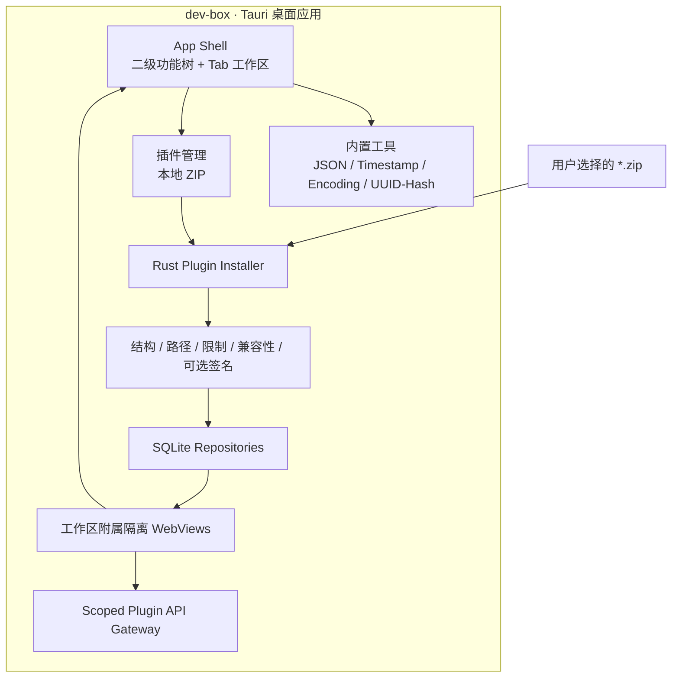

# DevBox 跨平台开发工具平台——技术架构设计

> 文档状态：架构基线 v3
>
> 更新日期：2026-09-19
>
> 目标平台：Windows / macOS / Linux
>
> 核心栈：Tauri 2、React、TypeScript、Vite、Rust、SQLite
>
> 仓库边界：平台与内置工具代码位于 `dev-box`；独立扩展使用单独 Git 项目

## 0. 摘要与关键决策

DevBox 是本地优先、可扩展的桌面开发工具箱。JSON、Timestamp、Encoding、UUID/Hash 是平台基础功能，随应用发布；第三方能力通过用户主动添加本地 ZIP 插件扩展。

当前基线：

1. 桌面容器采用 Tauri 2，界面采用 React + TypeScript，特权能力由 Rust Host 提供。
2. JSON、Timestamp、Encoding、UUID/Hash 直接维护在 `dev-box`，不作为插件安装或更新。
3. 平台不内置 Java 编辑器/Runner；Java 代码片段能力由独立 `devbox-java-runner` 插件提供，平台只提供受控 JShell Host API。SQL Formatter、JWT、正则测试和 HTTP Client 仍不实现。
4. 不提供在线插件目录、在线安装或自动更新，只允许用户选择本地 ZIP 安装自定义插件。
5. 允许安装未签名 ZIP，但安装前和安装后必须持续展示安全警告；不设置开发者模式开关。
6. 所有插件包仍执行路径、大小、压缩比、结构、入口和兼容性检查；存在签名时继续验证签名。
7. 插件运行在主窗口附属的隔离 WebView 中，以工作区 Tab 呈现，不打开独立窗口。
8. 左侧导航为“功能分类 → 具体功能”的二级树。内置功能和插件视图均声明分类、图标和顺序。
9. 工作区允许同时打开多个 Tab；同一功能只打开一次，支持关闭和拖动排序，重启后不恢复。
10. 平台支持 `zh-CN` 和 `en-US`；语言切换只放在设置页，功能页不重复提供切换入口。

## 1. 范围

### 1.1 MVP 目标

- 提供统一、快速、键盘友好的本地开发工具入口。
- 内置 JSON、时间戳、编码转换、UUID 与 SHA-2 摘要功能。
- 支持从本地 ZIP 添加、启停、打开、回退和卸载自定义 UI 插件。
- 为明确授权的插件提供受控 Java 代码片段执行能力，不提供完整 Java 工程编译。
- 保存插件版本、来源、权限、签名状态和安装事件。
- 默认不上传工具输入；内置工具全部在本地执行。
- 在 Windows、macOS、Linux 上保持一致的数据模型和主要交互。

### 1.2 非目标

- 不做在线插件市场、目录、下载、自动更新、账户、付费、评论或云同步。
- 不允许插件携带原生动态库、系统可执行文件、安装脚本或运行时依赖下载。
- 不开放任意 Shell、任意文件系统或任意网络访问。
- Java 片段通过固定参数的系统 JShell 执行；它不是操作系统级沙箱，必须显式授权并持续提示风险。
- 不恢复上次打开的 Tab，也不在功能页放语言切换控件。

## 2. 总体架构



信任边界：

1. ZIP 是不可信输入，只有 Rust Installer 可以写入插件目录。
2. 未签名只影响身份与内容可信度，不跳过结构、路径、资源和兼容性检查。
3. 插件 WebView 与主 React WebView 隔离，不能访问主应用状态或未经授权的 Host 能力。
4. Host 同时校验 WebView label、pluginId、版本、授权和参数。

## 3. 仓库与目录职责

`dev-box` 统一负责：

- App Shell、二级功能树、多 Tab 工作区、主题、国际化和可访问性。
- 四个内置工具的界面、算法、测试和发布。
- Plugin SDK、IPC contracts、UI SDK 和 manifest 校验。
- ZIP 解析、兼容性判断、可选签名验证、安装、升级、卸载、回退和恢复。
- 插件附属 WebView、身份绑定、生命周期、权限网关和 SQLite 数据。
- `java:execute` 的用户手势校验、输入/超时/输出/并发限制和 JShell 进程管理。

推荐目录：

```text
dev-box/
├─ apps/desktop/
│  ├─ src/
│  │  ├─ app/                 # 功能与分类注册
│  │  ├─ features/tools/      # 四个内置工具
│  │  ├─ features/plugins/    # ZIP 安装和插件管理
│  │  ├─ features/settings/
│  │  ├─ i18n/
│  │  ├─ ipc/
│  │  └─ stores/              # 仅内存 Tab 状态等
│  └─ src-tauri/
│     ├─ migrations/
│     └─ src/                 # commands、installer、repository、runtime
├─ packages/
│  ├─ plugin-sdk/
│  ├─ ipc-contracts/
│  ├─ ui/
│  └─ plugin-pack/
└─ fixtures/
```

`devbox-tools` 中的四个工具迁移完成后删除，不再形成独立发布链路。

## 4. 功能注册、导航与 Tab

### 4.1 统一功能模型

每个内置功能至少声明：

```ts
type BuiltinFeature = {
  id: string;
  titleKey: string;
  categoryId: string;
  icon: LucideIcon;
  order: number;
  component: React.ComponentType;
};
```

每个插件视图必须在 manifest 中声明：

```json
{
  "id": "example",
  "titleKey": "example.title",
  "icon": "plug",
  "order": 10,
  "category": {
    "id": "examples",
    "title": { "zh-CN": "示例", "en-US": "Examples" },
    "order": 70
  }
}
```

平台将两类注册表合并、按分类与功能顺序排序，并渲染为二级树。

### 4.2 Tab 状态

- Tab 状态只保存在内存 Zustand store，不写 SQLite 或本地存储。
- `openTab(id)` 对已打开功能只切换激活态，不创建副本。
- 关闭活动 Tab 后激活相邻 Tab；全部关闭后显示空工作区。
- 拖放只改变当前会话顺序。
- 插件被禁用或卸载时，关联 Tab 自动关闭并销毁其 WebView。

## 5. 内置工具

四个工具不经过 Plugin Installer，不显示插件签名、版本和权限：

| 功能 | 分类 | 核心能力 |
|---|---|---|
| JSON | 数据 | 格式化、压缩、校验、递归键排序、2 MiB 上限 |
| Timestamp | 转换 | 秒/毫秒/日期解析、ISO 和 IANA 时区显示 |
| Encoding | 转换 | Base64、URL、UTF-8 Hex 编解码 |
| UUID/Hash | 标识与摘要 | UUID v4 批量生成、SHA-256/384/512、Hex/Base64 |

工具算法保持无 UI 依赖并由单元测试覆盖；复制操作经浏览器剪贴板接口执行。

## 6. ZIP 插件规范

### 6.1 文件结构

```text
custom-plugin.zip
├─ plugin.json
├─ dist/
│  ├─ index.html
│  ├─ index.js
│  └─ index.css
├─ locales/                 # 可选
├─ checksums.json           # 可选；与 signature.json 同时出现
└─ signature.json           # 可选；与 checksums.json 同时出现
```

约束：

- 文件扩展名必须为 `.zip`，入口清单固定为 `plugin.json`。
- 压缩包、展开总量、单文件、文件数和压缩比均有限制。
- 禁止绝对路径、`..`、链接、重复路径、原生库、可执行文件和安装脚本。
- `checksums.json` 与 `signature.json` 必须同时存在或同时缺失。
- 无签名包标记为 `unsigned-development`，允许继续安装但必须显示醒目警告。
- 有签名且发布者受信任时必须验签；签名不完整或验证失败时拒绝安装。

### 6.2 安装流程

```text
选择 ZIP
→ 复制到 staging
→ 安全解析与 manifest 校验
→ 入口/语言资源/兼容性检查
→ 可选 checksum 与签名验证
→ 展示来源、权限、SHA-256 和未签名警告
→ 用户确认
→ 临时目录解包
→ 数据库事务与原子切换
→ 启用并加入功能树
```

安装失败不得破坏当前版本。每个插件保留当前版本和上一可用版本，用于手动或运行时失败回退。

## 7. 插件运行时

- 每个已打开插件视图对应一个唯一 child WebView label。
- child WebView 附着在主窗口工作区，位置与尺寸随 Tab 内容容器同步。
- 切换 Tab 时隐藏非活动 WebView；关闭 Tab 时销毁 WebView 并解除运行时身份绑定。
- 插件导航只允许自身 `devbox-plugin://<plugin-id>/...` 资源。
- 默认无文件、网络、进程和 Shell 权限。
- settings 按 pluginId 隔离；剪贴板要求 manifest 授权和近期真实用户手势。
- `java:execute` 要求 manifest 授权和近期真实用户手势；Host 固定 JShell 参数，限制 64 KiB 输入、5 秒超时、256 KiB 输出以及单插件单并发。
- Java 代码以当前用户权限运行，可能访问本机文件、网络或其他进程；安装确认必须显示安全警告，不能将其表述为沙箱。
- `ready` 超时、加载失败或异常可触发禁用/回退，不能拖垮 Shell。

## 8. 数据与安全

SQLite 保存：插件、版本、权限授权、安装事件和平台设置。Tab 顺序与打开状态不持久化。

未签名插件的安全表达：

- 选择 ZIP 前展示通用风险说明。
- 确认安装时展示未签名状态、发布者自述、完整包 SHA-256 与权限。
- 已安装列表持续显示 `Unsigned` 警告 badge。
- 不提供“信任并不再提醒”或开发者模式绕过。

## 9. 国际化

- 平台支持 `zh-CN` 和 `en-US`，语言优先级为用户设置 → 系统语言 → 英文 fallback。
- 语言切换只位于设置页；顶栏、工具页和插件页不放独立切换器。
- 平台文案使用 i18n key；Rust 返回结构化错误码和参数。
- 日期、数字和大小使用 `Intl`，持久化数据与语言无关。
- 插件分类必须直接提供中英文标题；插件语言文件随 ZIP 离线安装。

## 10. 验收基线

- 四个内置工具在中英文下可用，输入不经过插件安装或网络。
- 左侧只显示二级功能树，不保留工具/插件活动栏切换按钮。
- 多 Tab 可打开、单例、关闭、拖动排序；重启不恢复。
- 仅存在本地 ZIP 安装入口，界面和 Host 均无在线目录调用。
- 未签名 ZIP 可在明确警告后安装；恶意路径、超限、不兼容和无效签名仍被拒绝。
- 插件在工作区 Tab 内运行，不产生独立功能窗口。
- `pnpm check`、Rust fmt/clippy/test、构建和端到端检查通过。
