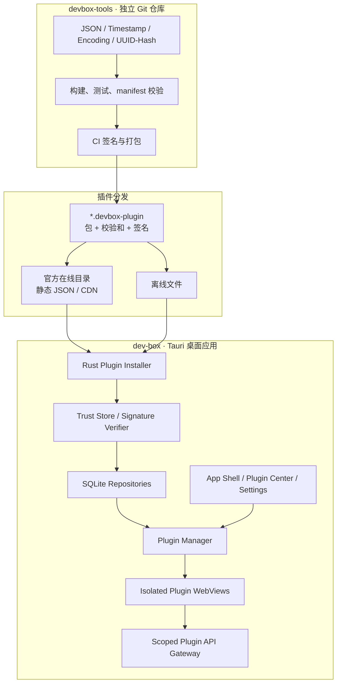

# DevBox 跨平台插件工具平台——技术架构设计

> 文档状态：架构基线 v2
> 更新日期：2026-09-17
> 目标平台：Windows / macOS / Linux
> 核心栈：Tauri 2、React、TypeScript、Vite、Rust、SQLite
> 仓库边界：`dev-box` 平台仓库、`devbox-tools` 官方工具仓库

## 0. 摘要与关键决策

DevBox 定位为一个本地优先、插件化、支持在线与离线安装插件的桌面工具平台。平台仓库只负责 Shell、Plugin SDK、插件分发、安全隔离和本地存储；具体开发工具放在独立的 `devbox-tools` Git 仓库，以签名插件包交付。

当前阶段的关键决策：

1. 桌面容器采用 Tauri 2，界面采用 React + TypeScript + Vite，特权能力统一由 Rust Host 提供。
2. 平台与工具分仓：`dev-box` 不直接实现具体工具业务，`devbox-tools` 独立构建和发布插件。
3. 首批工具仅包括 JSON、Timestamp、Encoding、UUID/Hash。
4. 当前范围明确不实现 SQL Formatter、JWT、正则测试、HTTP Client 和 Java 编辑/运行能力。
5. 在线与离线安装使用同一种 `.devbox-plugin` 包和同一条校验链路；离线安装不得绕过签名与兼容性检查。
6. 在线插件源第一阶段仅提供 DevBox 官方插件，不开放任意第三方市场投稿。
7. 运行时安装插件必须在独立 WebView 中运行，默认没有 Tauri IPC 权限；不把下载的 JavaScript 注入主 WebView。
8. 插件包不得包含原生动态库、可执行文件、安装脚本或运行时依赖下载。
9. 插件安装、更新和回退采用临时目录、完整校验与原子切换，任何失败不得破坏当前可用版本。
10. Plugin API、manifest schema 和插件包格式均独立版本化，并在安装前检查兼容性。

## 1. 项目目标与非目标

### 1.1 项目目标

- 提供统一、快速、键盘友好的本地开发工具入口。
- 支持官方插件的在线发现、安装、更新、禁用和卸载。
- 支持在无网络环境导入同一格式的离线插件包。
- 让平台和工具独立提交、测试、发布和回退。
- 确保插件来源、版本、签名、权限与运行状态可查看、可审计。
- 在 Windows、macOS、Linux 上保持一致的数据模型和交互。
- 默认不上传用户输入；首批工具均在本机 WebView 内完成计算。

### 1.2 非目标

- 首版不做公共插件商店、用户账户、付费、评论或云同步。
- 首版不允许任意第三方 JavaScript 在主 WebView 中执行。
- 首版不允许插件携带 Rust 动态库、Node.js 模块、系统可执行文件或安装脚本。
- 首版不开放任意 Shell、任意文件系统或任意网络访问。
- 首版不实现 SQL Formatter、JWT、正则测试、HTTP Client、Java Runner 或完整 IDE 能力。
- 首版不把“开发者模式”作为普通用户绕过签名检查的快捷入口。

### 1.3 设计原则

| 原则 | 落地方式 |
|---|---|
| 本地优先 | 工具计算、设置、插件包和安装记录均保存在本机 |
| 同包同链路 | 在线下载与离线导入最终进入同一个验证和安装服务 |
| 默认不信任 | 运行时插件隔离执行，未授权能力默认不可用 |
| 契约优先 | Plugin API、manifest、包格式、Registry API 均版本化 |
| 原子安装 | 临时下载、完整校验、原子切换、失败回滚 |
| 最小权限 | 首批工具权限为空；后续能力按 API 和资源范围授权 |
| 可追踪 | 保存来源、签名指纹、版本、安装时间、状态和失败原因 |
| 可回退 | 保留当前版本和上一可用版本，不直接覆盖插件目录 |
| 双语一致 | 平台和插件均提供 `zh-CN`、`en-US` 离线资源 |

## 2. 总体架构



核心信任边界：

1. 在线目录只是元数据来源，不能替代插件包签名。
2. 离线文件属于不可信输入，必须执行与在线包相同的校验。
3. Rust Installer 是唯一可以写入插件安装目录的组件。
4. 插件 WebView 与主 WebView 隔离，不能读取主应用 React 状态。
5. Host 同时校验 WebView label、pluginId、grant 和参数，不能只相信请求中的 pluginId。

## 3. 双仓库职责边界

### 3.1 `dev-box` 平台仓库

负责：

- Tauri 应用、App Shell、主题、国际化和可访问性。
- Plugin SDK、UI SDK、IPC contracts 和 manifest schema。
- 插件包解析、签名验证、兼容性判断、安装、升级、卸载和回退。
- 在线插件目录客户端、离线文件选择和安装确认界面。
- 独立 WebView 创建、身份绑定、生命周期和故障隔离。
- SQLite migration、插件记录、授权、设置、安装事务和审计事件。
- 三平台安装包、平台级 E2E 和最终集成测试。

不负责：

- JSON、时间戳、编码、UUID、摘要等具体工具算法和页面。
- 工具插件的独立发布节奏与业务版本。

### 3.2 `devbox-tools` 工具仓库

负责：

- JSON、Timestamp、Encoding、UUID/Hash 四个插件。
- 插件 manifest、中英文资源、组件、算法和单元测试。
- 使用公开 Plugin SDK/UI SDK，不引用平台内部源码。
- 构建自包含静态产物，生成 checksum 和 `.devbox-plugin` 包。
- 通过发布环境密钥签名，生成官方在线目录元数据。
- 发布说明、兼容范围和工具级截图回归。

禁止：

- 直接导入 `apps/desktop/src/*`、平台 Zustand store 或内部 CSS。
- 直接调用 Tauri `invoke`、硬编码 Rust command 名称。
- 把 React、React DOM、i18next 打进插件运行时的重复实例。
- 通过安装脚本或运行时网络请求补齐依赖。

### 3.3 推荐目录

```text
dev-box/
├─ apps/desktop/
│  ├─ src/
│  │  ├─ app/
│  │  ├─ features/plugin-center/
│  │  ├─ features/plugin-manager/
│  │  ├─ i18n/
│  │  ├─ ipc/
│  │  └─ stores/
│  └─ src-tauri/
│     ├─ migrations/
│     └─ src/
│        ├─ commands/plugins/
│        ├─ installer/
│        ├─ registry/
│        ├─ repositories/
│        ├─ security/
│        └─ webviews/
├─ packages/
│  ├─ plugin-sdk/
│  ├─ ipc-contracts/
│  ├─ ui/
│  └─ plugin-pack/
└─ schemas/
   └─ plugin-manifest.schema.json

devbox-tools/
├─ plugins/
│  ├─ json-tool/
│  ├─ timestamp-tool/
│  ├─ encoding-tool/
│  └─ uuid-hash-tool/
├─ packages/
│  └─ shared-utils/
├─ scripts/
│  ├─ validate.mjs
│  ├─ pack.mjs
│  └─ catalog.mjs
└─ dist/
   └─ *.devbox-plugin
```

## 4. 插件分类与运行模型

### 4.1 平台内置模块

平台只保留 Foundation、Plugin Center、Settings 和故障恢复等平台模块。它们随桌面应用构建，不通过在线目录更新。

### 4.2 官方安装插件

四个通用工具均作为官方签名插件交付。桌面安装包可以附带一组 `.devbox-plugin` 作为离线种子包，首次启动时通过标准 Installer 安装；后续更新从官方在线目录获取。

### 4.3 开发者插件

未签名包默认拒绝。开发者模式需显式开启，并满足：

- 每次安装显示未签名警告和包摘要。
- 插件仍在独立 WebView 中运行。
- 不授予文件、网络、进程等特权能力。
- UI 始终显示 `Unsigned` 和来源路径。
- 可一键退出开发者模式并禁用所有未签名插件。

### 4.4 生命周期

```text
downloaded/imported
  → inspecting
  → signature-verified
  → compatible
  → awaiting-confirmation
  → staging
  → installed
  → loading
  → active

任一阶段 → rejected / failed
active → disabled → active
active → updating → active / rolled-back
installed → uninstalling → removed
```

状态必须持久化。应用异常退出后，`staging`、`updating` 和 `uninstalling` 状态在下次启动时执行恢复或回滚。

## 5. `.devbox-plugin` 包规范

### 5.1 文件结构

```text
json-tool-1.0.0.devbox-plugin
├─ manifest.json
├─ checksums.json
├─ signature.ed25519
├─ dist/
│  ├─ index.html
│  ├─ index.js
│  └─ index.css
├─ locales/
│  ├─ en-US.json
│  └─ zh-CN.json
└─ assets/
```

约束：

- 使用 ZIP 容器但采用专用扩展名。
- 单包压缩后默认不超过 20 MiB，解压后默认不超过 60 MiB。
- 文件数量、单文件大小、路径长度和压缩比均设上限。
- 禁止绝对路径、`..`、符号链接、硬链接、设备文件和重复规范化路径。
- 只允许 HTML、CSS、JavaScript、JSON、字体和白名单图片格式。
- 禁止可执行位、原生库、脚本入口和包管理器生命周期脚本。

### 5.2 Manifest

```json
{
  "schemaVersion": 1,
  "id": "devbox.official.json-tool",
  "name": "JSON Tool",
  "version": "1.0.0",
  "publisher": "devbox",
  "descriptionKey": "plugin-json:description",
  "engines": {
    "devbox": ">=0.2.0 <0.3.0",
    "pluginApi": "^1.0.0"
  },
  "entry": "dist/index.html",
  "activationEvents": ["onView:json-tool"],
  "permissions": [],
  "locales": ["en-US", "zh-CN"],
  "contributes": {
    "views": [
      {
        "id": "json-tool",
        "titleKey": "plugin-json:navigation.title",
        "icon": "braces",
        "order": 10
      }
    ],
    "commands": [
      {
        "id": "json.format",
        "titleKey": "plugin-json:commands.format"
      }
    ]
  }
}
```

安装前校验：

- schema 和未知字段策略。
- plugin ID、publisher、SemVer 和 entry 路径。
- DevBox、Plugin API、包格式版本兼容范围。
- contribution ID 唯一性和翻译 key 完整性。
- 权限是否属于平台支持的稳定权限集合。
- manifest、checksums 和实际文件是否一致。

### 5.3 完整性与签名

`checksums.json` 对除签名文件外的所有文件记录规范化路径、字节数和 SHA-256。签名覆盖规范化后的 manifest 与 checksums 内容。

信任策略：

- DevBox 官方根公钥随应用内置。
- 在线目录返回的 hash 和 signature 只用于提前展示，最终以包内内容和本地验证结果为准。
- 私钥只存在于 `devbox-tools` 发布 CI 的 Secret 中，不进入代码仓库和构建产物。
- 支持公钥轮换、撤销列表和签名算法版本字段。
- 校验逻辑只在 Rust Host 中实现，前端仅展示结果。

## 6. 在线与离线安装

### 6.1 统一安装管线

```text
来源解析
→ 写入随机临时文件
→ 大小与格式预检
→ 安全解包到 staging
→ checksum 校验
→ 签名与发布者校验
→ manifest/schema/兼容性校验
→ 权限与变更摘要
→ 用户确认
→ SQLite 安装事务
→ 原子切换 current 版本
→ 创建隔离 WebView
→ 健康检查
→ 完成或回滚
```

在线和离线的差异只发生在“来源解析”：在线为 HTTPS 下载，离线为用户选择的本地文件。之后必须进入完全相同的代码路径。

### 6.2 在线目录

第一阶段使用只读静态目录：

```json
{
  "catalogVersion": 1,
  "generatedAt": "2026-09-17T00:00:00Z",
  "plugins": [
    {
      "id": "devbox.official.json-tool",
      "version": "1.0.0",
      "packageUrl": "https://plugins.devbox.example/json-tool/1.0.0.devbox-plugin",
      "sha256": "...",
      "signature": "...",
      "minDevboxVersion": "0.2.0"
    }
  ]
}
```

规则：

- 生产环境只允许 HTTPS 和配置的官方 origin。
- 设置连接、下载、总耗时、重定向次数和包体大小上限。
- 下载到临时文件，不在内存中累计完整包。
- 目录不可授予权限，也不可覆盖本地签名验证结果。
- 网络失败不影响已安装插件和离线安装入口。

### 6.3 离线安装

- 使用系统文件选择器选择一个 `.devbox-plugin` 文件。
- UI 在安装前展示路径、大小、插件 ID、版本、发布者、签名状态、权限和兼容性。
- 不直接从原路径运行；复制到 DevBox staging 后校验。
- 文件后缀不是信任依据，内容必须完整解析。
- 已安装同版本提供“重新验证”，升级和降级需要明确确认。

### 6.4 更新、回退与卸载

- 更新先安装到新版本目录，健康检查成功后再切换 `current`。
- 默认保留上一个可用版本；容量策略可清理更旧版本。
- 插件启动连续失败时自动回退并记录原因。
- 卸载先停用 WebView、释放 listener，再移动到回收目录，最后提交数据库事务。
- 插件数据默认保留，用户可在二次确认后选择同时删除。

## 7. 插件隔离与权限模型

### 7.1 独立 WebView

运行时插件使用稳定 label：

```text
plugin--<normalized-plugin-id>--<instance-id>
```

Host 维护不可由前端修改的绑定：

```text
webview label → pluginId → installedVersion → grantedPermissions
```

插件 WebView 默认只获得渲染、主题、locale 和消息桥能力，不直接获得 Tauri core、文件、网络、进程或系统 Shell 权限。

### 7.2 Plugin API

首版公开 API：

```ts
interface PluginAPI {
  readonly context: {
    pluginId: string;
    version: string;
    locale: "zh-CN" | "en-US";
    theme: "light" | "dark";
  };
  readonly settings: {
    get(key: string): Promise<JsonValue | undefined>;
    update(key: string, value: JsonValue, expectedRevision?: number): Promise<number>;
  };
  readonly clipboard: {
    writeText(value: string): Promise<void>;
  };
  readonly host: {
    openCommandPalette(): Promise<void>;
    reportReady(): Promise<void>;
  };
}
```

首批四个工具不需要文件、网络或进程权限。Clipboard API 只允许由明确用户手势触发的文本写入。

### 7.3 三层校验

1. **Tauri capability**：限制特定 WebView 能否触达某类 command。
2. **DevBox grant**：校验插件版本是否获得对应能力和资源范围。
3. **参数策略**：对 key、长度、频率、大小和调用时机再次校验。

插件声明权限不等于自动授权；升级新增权限时必须重新确认。

## 8. SQLite 数据模型

```sql
CREATE TABLE plugin_publishers (
  publisher_id       TEXT PRIMARY KEY,
  display_name       TEXT NOT NULL,
  public_key         TEXT NOT NULL,
  key_fingerprint    TEXT NOT NULL UNIQUE,
  trust_level        TEXT NOT NULL CHECK (trust_level IN ('official','trusted','developer','revoked')),
  created_at         TEXT NOT NULL,
  revoked_at         TEXT
);

CREATE TABLE plugins (
  plugin_id          TEXT PRIMARY KEY,
  publisher_id       TEXT NOT NULL,
  enabled            INTEGER NOT NULL DEFAULT 1,
  current_version    TEXT,
  previous_version   TEXT,
  source             TEXT NOT NULL CHECK (source IN ('bundled','online','offline','developer')),
  status             TEXT NOT NULL,
  installed_at       TEXT NOT NULL,
  updated_at         TEXT NOT NULL,
  last_error_code    TEXT,
  FOREIGN KEY (publisher_id) REFERENCES plugin_publishers(publisher_id)
);

CREATE TABLE plugin_versions (
  plugin_id          TEXT NOT NULL,
  version            TEXT NOT NULL,
  install_path       TEXT NOT NULL,
  package_sha256     TEXT NOT NULL,
  signature          TEXT,
  key_fingerprint    TEXT,
  manifest_json      TEXT NOT NULL,
  health_status      TEXT NOT NULL,
  installed_at       TEXT NOT NULL,
  PRIMARY KEY (plugin_id, version),
  FOREIGN KEY (plugin_id) REFERENCES plugins(plugin_id) ON DELETE CASCADE
);

CREATE TABLE plugin_grants (
  plugin_id          TEXT NOT NULL,
  permission_key     TEXT NOT NULL,
  scope_json         TEXT NOT NULL DEFAULT '{}',
  granted            INTEGER NOT NULL DEFAULT 0,
  revision           INTEGER NOT NULL DEFAULT 1,
  updated_at         TEXT NOT NULL,
  PRIMARY KEY (plugin_id, permission_key),
  FOREIGN KEY (plugin_id) REFERENCES plugins(plugin_id) ON DELETE CASCADE
);

CREATE TABLE plugin_settings (
  plugin_id          TEXT NOT NULL,
  setting_key        TEXT NOT NULL,
  value_json         TEXT NOT NULL,
  revision           INTEGER NOT NULL DEFAULT 1,
  updated_at         TEXT NOT NULL,
  PRIMARY KEY (plugin_id, setting_key),
  FOREIGN KEY (plugin_id) REFERENCES plugins(plugin_id) ON DELETE CASCADE
);

CREATE TABLE plugin_install_events (
  event_id           TEXT PRIMARY KEY,
  plugin_id          TEXT,
  version            TEXT,
  source             TEXT NOT NULL,
  action             TEXT NOT NULL,
  result             TEXT NOT NULL,
  error_code         TEXT,
  occurred_at        TEXT NOT NULL
);
```

Repository 规则：

- React 和插件不直接访问数据库。
- 安装事务、文件切换和数据库提交必须有明确恢复点。
- 应用启动时把未完成的 `staging/updating/uninstalling` 修复为回滚或失败状态。
- 路径存储前规范化，实际访问时仍需限制在 DevBox 插件根目录内。
- 安装事件不记录用户工具输入、完整本地路径或包内容。

## 9. App Shell、Plugin Center 与设置

### 9.1 App Shell

- 顶栏：品牌、命令面板入口、主题和语言状态。
- 活动栏：工具、Plugin Center、设置。
- 导航栏：已启用插件贡献的页面。
- 主工作区：平台页面或隔离插件 WebView 容器。
- 状态栏：本地状态、插件状态、更新和错误入口。

### 9.2 Plugin Center

页面包含：

- `Installed`：已安装、来源、版本、状态、启停和更新。
- `Online`：官方目录、搜索、版本、兼容性和安装。
- `Offline`：选择文件、预检摘要和安装结果。
- `Updates`：可更新项、权限变化、发布说明和回退入口。

任何安装确认页必须展示：插件名称、ID、版本、发布者、来源、签名状态、兼容性、包大小、权限变化和将被替换的版本。

### 9.3 设置

- General：语言、启动行为。
- Appearance：主题、密度。
- Plugins：在线源、自动检查更新、保留旧版本数量。
- Security：可信发布者、撤销状态、开发者模式。
- Privacy & Logs：本地日志级别、诊断信息预览与清理。

## 10. 国际化

- 平台和插件必须包含 `zh-CN`、`en-US`，fallback 为 `en-US`。
- 插件安装确认、签名错误、兼容性错误和权限说明全部使用平台 namespace。
- 插件自身使用独立 namespace，不允许覆盖平台资源。
- 插件包缺少声明语言资源时安装失败。
- CI 校验中英文 key 集合一致、非空和无未使用关键入口文案。
- 日期、数字、大小和相对时间通过 `Intl` 格式化；数据库存 UTC 和语言无关值。
- 在线目录文案不作为可信 HTML 渲染，只按纯文本展示并设置长度上限。

## 11. 首批官方工具

### 11.1 JSON Tool

- 格式化、压缩、校验和错误位置。
- 可选对象 key 排序，但默认保持原始顺序。
- Copy、Clear、Wrap；失败时不覆盖原始输入。
- 限制输入长度，超限时给出明确提示。

### 11.2 Timestamp Tool

- 秒/毫秒自动识别并明确显示单位。
- 时间戳与日期互转。
- 本地、UTC 和常见 IANA 时区展示。
- 当前时间、复制和无效日期提示。

### 11.3 Encoding Tool

- Base64 编码/解码。
- URL component 编码/解码。
- UTF-8 文本与 Hex 转换。
- 明确区分文本、字节和编码错误。

### 11.4 UUID/Hash Tool

- UUID v4 单个与批量生成。
- SHA-256、SHA-384、SHA-512 文本摘要。
- 展示字符数、UTF-8 字节数和输出格式。
- 明确说明摘要不是加密，不提供 SHA-1 作为默认选项。

四个插件均为纯前端计算，权限声明为空，不读取文件、不访问网络、不启动进程。

## 12. 构建、发布与联调

### 12.1 SDK 发布

`@devbox/plugin-sdk`、`@devbox/ui` 和 manifest types 使用 SemVer 发布。`devbox-tools` 只依赖公开版本，不使用跨仓库 `workspace:*`。

React、React DOM 和 i18next 声明为 peer dependencies，避免插件包带入重复运行时。

### 12.2 本地联调

- 快速开发可使用显式路径的 `pnpm link`。
- 集成验收使用 `pnpm pack` 或生成的 `.devbox-plugin`，不以 link 结果代替发布验证。
- 平台仓库提供本地开发源目录配置，但该配置不进入生产包。

### 12.3 发布流水线

```text
devbox-tools tag
→ 安装锁定依赖
→ lint / typecheck / unit / component / locale
→ 构建自包含静态产物
→ 生成 manifest 与 checksums
→ 使用 CI Secret 签名
→ 生成 *.devbox-plugin
→ 空白 DevBox 安装测试
→ 发布 Release 与目录元数据
```

平台 release 锁定种子插件的确定版本和 SHA-256，不使用 `latest`。

## 13. 测试策略

### 13.1 平台测试

- 包解析、路径规范化、压缩炸弹、重复路径和非法文件类型。
- checksum、签名、公钥轮换、撤销和篡改检测。
- DevBox/API 版本兼容、升级新增权限和降级确认。
- 在线超时、断网、下载中断、重定向和错误目录。
- 离线导入、重复安装、原子替换、回退和卸载恢复。
- WebView label/pluginId 伪造、越权 IPC 和未授权调用。
- Windows、macOS、Linux 安装路径和文件锁差异。

### 13.2 工具测试

- JSON 合法/非法/空输入/大输入。
- 时间戳秒毫秒、负值、DST 和无效日期。
- Base64、URL、Hex 的 Unicode、空值和非法输入。
- UUID 格式、批量上限和 SHA 标准测试向量。
- 中英文、深浅主题、760/960 px 断点和键盘流程。

### 13.3 端到端验收

```text
启动无插件的 DevBox
→ 从在线目录安装官方 JSON Tool
→ 激活并完成一次格式化
→ 禁用、启用并重启恢复
→ 更新到新版本并回退
→ 卸载
→ 断网
→ 从本地导入同一个签名包
→ 再次完成格式化
```

## 14. 里程碑

| 里程碑 | 目标 | 退出条件 |
|---|---|---|
| M0 工程基线 | 建立可持续开发的 monorepo | 已完成并验收 |
| M1 Shell 与平台骨架 | 打通 Shell、i18n、Plugin SDK、IPC、SQLite | 已完成并验收 |
| M2 插件分发基础 | 包格式、签名、统一安装管线、隔离与回退 | 同一签名示例包可在线和离线安装 |
| M3 官方通用工具 | 独立 `devbox-tools` 仓库交付四个工具 | 四个插件均以签名包安装并通过核心测试 |
| M4 Plugin Center 体验 | 完整在线目录、更新、权限、恢复和开发者模式 | 安装管理关键流程中英文 E2E 通过 |
| M5 稳定性与发布 | 三平台、安全、性能和用户文档 | 形成可分发 MVP 候选版本 |

## 15. 关键风险与取舍

| 风险 | 影响 | 缓解方式 |
|---|---|---|
| Plugin API 过早冻结 | 双仓库升级困难 | 先使用 `0.x`，建立契约测试和明确兼容范围 |
| 下载代码供应链风险 | 本机代码被篡改 | HTTPS、checksum、签名、可信发布者和撤销机制 |
| ZIP 路径穿越/压缩炸弹 | 写出插件目录或耗尽磁盘 | Rust 安全解包、规范化路径、数量/大小/比率限制 |
| 插件读取主应用状态 | 权限和数据泄露 | 独立 WebView，不向主 WebView 注入运行时代码 |
| 文件事务与数据库不一致 | 半安装、无法启动 | staging、原子 rename、恢复状态和上一版本回退 |
| 双仓库版本漂移 | 构建失败或运行不兼容 | SemVer、契约测试、固定版本、跨仓库兼容矩阵 |
| 在线目录不可用 | 无法发现新插件 | 已安装插件不受影响，保留离线安装和种子包 |
| 未签名开发包误用 | 普通用户安装不可信代码 | 开发者模式隔离、醒目标识、默认关闭、无特权权限 |

## 16. 最终技术选型

| 领域 | 选择 |
|---|---|
| Desktop | Tauri 2 |
| UI | React + TypeScript + Vite |
| Styling | TailwindCSS + DevBox 语义组件 |
| State | Zustand |
| i18n | i18next + react-i18next |
| Host | Rust commands + scoped gateway |
| Storage | SQLite + migrations + Repository |
| Plugin package | ZIP 容器 + `.devbox-plugin` 扩展名 |
| Integrity | SHA-256 file checksums |
| Signing | Ed25519，Rust Host 验签 |
| Online catalog | HTTPS 静态 JSON，首版官方源 |
| Runtime isolation | 独立 Tauri WebView + capability + DevBox grant |
| Tool distribution | `devbox-tools` 独立 Git 仓库和签名 release |

## 17. 参考资料

- [Tauri 2 Architecture](https://v2.tauri.app/concept/architecture/)
- [Tauri Capabilities](https://v2.tauri.app/security/capabilities/)
- [Tauri Runtime Authority](https://v2.tauri.app/security/runtime-authority/)
- [Tauri Updater](https://v2.tauri.app/plugin/updater/)
- [pnpm Workspace](https://pnpm.io/workspaces)
- [pnpm link](https://pnpm.io/cli/link)
- [Git Submodules](https://git-scm.com/book/en/v2/Git-Tools-Submodules)
- [JSON Schema 2020-12](https://json-schema.org/draft/2020-12)
- [Semantic Versioning](https://semver.org/)
- [Web Crypto API](https://developer.mozilla.org/docs/Web/API/Web_Crypto_API)
- [Intl.DateTimeFormat](https://developer.mozilla.org/docs/Web/JavaScript/Reference/Global_Objects/Intl/DateTimeFormat)

## 18. 开发任务拆解

实施顺序、任务依赖、规模和验收结果见 [DevBox MVP 开发任务拆解](./devbox-development-task-breakdown.md)。当前顺序为：完成平台骨架后先建设插件分发基础，再由独立工具仓库交付四个官方插件，最后完善 Plugin Center 和三平台发布。
