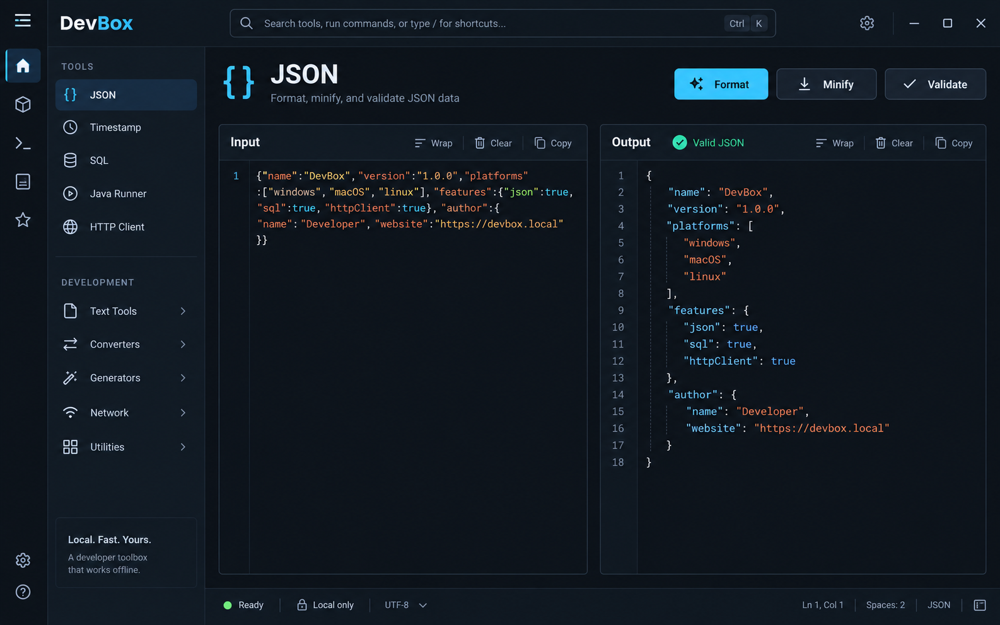

# DevBox 统一界面设计规范

> 依据《DevBox 跨平台开发工具平台——技术架构设计》整理。
>
> 更新日期：2026-09-19
>
> 适用范围：App Shell、内置工具、设置、本地 ZIP 插件管理和插件工作区。

## 1. 设计目标

DevBox 的界面应体现“本地优先、快速、克制、可审计”。界面保持高信息密度，不使用装饰性渐变、玻璃拟态或营销式大卡片。

1. **工作区优先**：主要空间用于输入、结果和实际功能。
2. **统一导航**：内置功能和插件都进入同一二级功能树。
3. **统一工作方式**：具体功能在工作区 Tab 中打开，不弹出功能窗口。
4. **状态可见**：插件来源、签名、权限和错误在相邻上下文中呈现。
5. **安全不隐藏**：未签名状态在安装前后持续可见。
6. **跨平台稳定**：主要信息架构不随操作系统改变。

## 2. App Shell

基准画布为 1440 × 900，窗口缩放后采用弹性布局。

| 区域 | 基准尺寸 | 说明 |
|---|---:|---|
| 顶栏 | 56 px | 品牌、全局搜索/命令入口、主题状态 |
| 二级导航 | 240–260 px | 一级功能分类、二级具体功能 |
| Tab 栏 | 36 px | 已打开功能、关闭和排序 |
| 主工作区 | 自适应 | 内置功能、平台页面或插件 child WebView |
| 状态栏 | 28 px | 就绪状态、自定义插件数量和版本 |

Shell 规则：

- 不设置独立图标活动栏，不保留“工具/插件”中间切换按钮。
- 左侧一级菜单为功能大类，二级菜单为具体功能；两级均由注册信息生成。
- 顶栏保留 `Ctrl/Cmd + K` 全局搜索，不提供语言切换按钮。
- 语言切换只在设置页出现。
- 选中功能使用浅色表面和左侧 2 px 强调线。
- 窄于 760 px 时侧栏可隐藏，主工作区保持可用。

## 3. 功能树

- 一级分类可展开/折叠，默认展开内置分类。
- 二级项显示 Lucide 图标和本地化名称，不显示来源标签。
- 分类按 `category.order` 排序，功能按 `view.order` 排序。
- 内置分类标题使用平台 i18n key；插件分类必须在 manifest 中提供中文和英文标题。
- 点击二级项时打开或激活对应 Tab；同一功能不会创建重复 Tab。
- 禁用或卸载插件时，其导航项和已打开 Tab 同步移除。

## 4. Tab 工作区

- 允许同时打开多个功能 Tab。
- 每个功能在一个会话中最多一个 Tab；再次点击只激活已有 Tab。
- 每个 Tab 显示功能图标、标题和关闭按钮。
- Tab 支持鼠标拖动重新排序，并支持键盘聚焦和关闭。
- 右键 Tab 显示平台菜单：关闭当前、关闭所有、关闭右侧、关闭其他；不可执行项置灰。
- 关闭当前 Tab 后激活相邻项；全部关闭后展示空工作区指引。
- 内置功能面板在 Tab 切换后保留当前会话输入。
- 插件以附属 child WebView 覆盖在活动面板内；非活动时隐藏，关闭时销毁。
- 不持久化 Tab 列表、顺序或输入，重启始终进入默认内置功能。

## 5. Design Tokens

### 5.1 颜色

| Token | 深色值 | 用途 |
|---|---|---|
| `--bg-canvas` | `#0B0F14` | 应用背景 |
| `--bg-surface` | `#111821` | 侧栏、面板 |
| `--bg-elevated` | `#17212C` | 输入框、选中区域、浮层 |
| `--border` | `#263241` | 边界与分隔线 |
| `--text` | `#E8EDF2` | 主文字 |
| `--text-muted` | `#8B98A7` | 次要文字、占位符 |
| `--accent` | `#43C6E8` | 主按钮、焦点、活动标签 |
| `--success` | `#55D6A7` | 成功、已验证 |
| `--warning` | `#F2B84B` | 未签名、权限变化 |
| `--danger` | `#EF6A78` | 无效签名、删除、阻塞错误 |

浅色主题保持相同语义映射。插件不得修改 Shell token 或硬编码全局品牌色。

### 5.2 字体、间距和形状

- UI 使用系统无衬线字体，正文 13–14 px / 20 px。
- 页面标题 28–40 px，区块标题 16 px；JSON、编码结果和摘要使用等宽字体。
- 使用 8 px 间距网格，紧凑控件内部可使用 4 px。
- 页面内边距 24–32 px，面板内边距 16–22 px。
- 默认圆角 8–10 px；输入和按钮高度 36 px。
- 焦点环为 2 px `accent`，正文对比度符合 WCAG AA。

## 6. 公共组件规则

### 6.1 Toolbar 与表单

- 每页最多一个高强调主按钮。
- Copy、Clear、Wrap 等局部动作放在所属面板标题栏。
- Label 位于控件上方；即时错误显示在字段或面板内，不弹 toast。
- 危险动作使用 danger 语义；禁用与卸载必须明确区分。

### 6.2 Panel 与结果

- JSON、Encoding 优先左右分栏；窄窗口改为纵向排列。
- Timestamp 使用输入配置和逐行结果结构。
- UUID/Hash 使用内部模式切换，不创建新的工作区 Tab。
- 错误不得清空上一次有效结果，除非用户主动 Clear。

### 6.3 状态表达

| 类型 | 表达方式 |
|---|---|
| 成功 | 相邻绿色状态、版本和来源 |
| 用户可修复错误 | 字段或面板内错误，加明确修复动作 |
| 权限错误 | 权限名称和处理说明 |
| 内部错误 | 简短信息、correlationId、复制诊断 |
| 未签名插件 | 持久 warning callout 与 badge |
| 无效签名 | 红色阻塞状态，禁止安装 |

## 7. 内置工具

### 7.1 JSON

- 左侧 Input、右侧 Result，结构对称。
- Format 为主动作，Compact、Sort keys、Wrap、Clear 为次动作。
- 显示 UTF-8 输入大小；上限 2 MiB。
- 解析失败显示行列位置，并保留上一次有效结果。

### 7.2 Timestamp

- 输入支持秒、毫秒和日期文本，结果明确显示秒、毫秒、ISO、本地时间和目标时区。
- 时区使用 IANA 名称；“使用当前时间”为次动作。
- 每一行结果提供复制动作。

### 7.3 Encoding

- 使用 Base64、URL、UTF-8 Hex 模式和 Encode/Decode 方向选择。
- 沿用左右输入/结果结构，提供交换、清空和复制。
- 非法 Base64、URL 转义、Hex 或 UTF-8 显示行内错误。

### 7.4 UUID/Hash

- 页面内部使用 UUID v4 与 Hash 两种模式。
- UUID 支持 1–1000 个批量生成和复制全部。
- Hash 支持 SHA-256、SHA-384、SHA-512，以及 Hex/Base64 输出。
- 常驻显示字符数、UTF-8 字节数和“摘要不是加密”的说明。

四个工具都是平台基础功能，不显示插件来源、签名、权限、安装或卸载操作。

## 8. 插件管理与本地安装

### 8.1 信息架构

插件管理只有两个页签：

- `Installed`：自定义插件、启停、打开、回退、卸载和签名状态。
- `Add ZIP Plugin`：选择本地 ZIP、预检、安全确认和安装。

不得显示 Online、Catalog、Updates 或开发者模式入口。

### 8.2 选择与预检

- 文件选择器只展示 `.zip`。
- 选择后先执行预检，不立即安装。
- 确认界面展示名称、ID、版本、发布者、自述权限、包 SHA-256、兼容性和安装/更新类型。
- 未签名包使用 warning 图标和醒目说明：“无法验证发布者与内容完整性，仅安装来自可信来源的 ZIP”。
- 路径非法、超限、不兼容、签名不完整或签名无效时阻止安装。

### 8.3 已安装插件

- 每行显示图标、名称、发布者、版本、来源和状态。
- 未签名插件持续显示 `Unsigned` danger/warning badge。
- Open 在工作区创建或激活插件 Tab，不打开独立窗口。
- Disable 会移除导航项并关闭关联 Tab；Uninstall 可选择保留或删除插件数据。
- 不提供“信任此发布者并不再提醒”。

## 9. 国际化

MVP 支持简体中文 `zh-CN` 和英文 `en-US`。设置页提供“跟随系统 / 简体中文 / English”。

- 语言切换控件只出现在设置页。
- 切换后 Shell、功能树、Tab、内置工具、插件管理、错误和可访问名称立即更新。
- 平台文案使用稳定语义 key，不以英文原文作为 key。
- Rust/IPC 返回错误码与结构化参数，最终文案由 UI 本地化。
- 日期、数字、大小使用 `Intl`；布局为翻译预留至少 30% 伸缩空间。
- 插件分类标题必须同时提供 `zh-CN` 和 `en-US`；插件资源随 ZIP 离线安装。
- CI 校验中英文 key 一致。

## 10. 键盘与可访问性

- `Ctrl/Cmd + K` 打开命令面板；`Esc` 关闭浮层。
- 功能树、Tab、关闭按钮、表单和插件安装确认均支持键盘操作。
- 所有图标按钮具有可访问名称，状态不能只依赖颜色。
- 安装确认打开时焦点进入对话框，关闭后返回触发按钮。
- 分类展开状态、活动 Tab 和选中功能通过语义属性暴露。

## 11. 设计图使用说明

`devbox-ui-json-tool.png` 继续作为工具页面视觉基准，`devbox-ui-plugin-permissions.png` 仅作为插件安全信息布局参考。原 Java Runner、HTTP Client 和在线插件市场图片不再作为 MVP 验收依据。实现以本文的二级功能树、多 Tab、本地 ZIP 和设置页语言入口为准。
