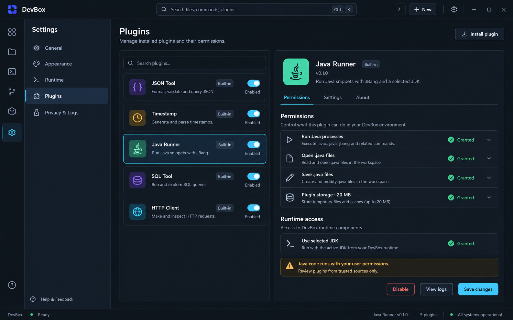

# DevBox 统一界面设计规范

> 依据《DevBox 跨平台插件工具平台——技术架构设计》整理。
> 更新日期：2026-09-17
> 适用范围：App Shell、Plugin Center、在线/离线安装、设置，以及 JSON、Timestamp、Encoding、UUID/Hash 四个官方插件。

## 1. 设计目标

DevBox 的界面应体现“本地优先、快速、可审计、键盘友好”。视觉上保持克制、清晰和高信息密度，不采用装饰性渐变、玻璃拟态或大面积营销卡片。插件可以拥有不同工作流，但必须共享 Shell、语义色、间距、状态表达和错误处理方式。

核心原则：

1. **工作区优先**：尽可能把空间留给输入、结果和插件管理信息。
2. **状态可见**：插件来源、签名、兼容性、安装进度、权限和错误在相邻上下文中呈现。
3. **能力可预期**：同类工具使用一致的分栏、工具栏、复制和错误结构。
4. **安全不隐藏**：签名、发布者、权限变化和未签名状态不能藏在二级页面。
5. **跨平台稳定**：使用应用自己的布局与组件，主要信息架构不随系统改变。

## 2. 统一 App Shell

基准画布为 1440 × 900，窗口缩放后采用弹性布局。

| 区域 | 基准尺寸 | 说明 |
|---|---:|---|
| 顶栏 | 56 px | 品牌、全局搜索/命令入口、全局动作、窗口控制 |
| 图标轨 | 64 px | 工具、Plugin Center、设置 |
| 导航侧栏 | 232 px | 已启用工具、插件分组或设置二级导航 |
| 主工作区 | 自适应 | 插件内容或平台页面，最小宽度建议 680 px |
| 右侧检查器 | 300–360 px | 插件详情、签名、权限或转换选项 |
| 底部面板 | 180–320 px | 安装详情、错误或审计摘要；按需出现 |
| 状态栏 | 28 px | 本地状态、语言、插件状态和更新提示 |

Shell 规则：

- 顶栏始终保留全局搜索/命令入口，快捷键为 `Ctrl/Cmd + K`。
- 图标轨固定提供 Plugin Center 入口；存在更新时显示数量 badge，但不持续闪烁。
- 插件导航只显示名称与 Lucide 图标；选中态使用浅色表面加左侧 2 px 强调线。
- 页面标题区包含标题、单行说明和 1–3 个主动作；主动作靠右。
- 面板之间使用 1 px 边界和可拖动分隔线，不用重阴影制造层级。
- 状态栏只显示当前页面相关信息，不作为第二个工具栏。

## 3. Design Tokens

### 3.1 颜色

| Token | 值 | 用途 |
|---|---|---|
| `--background` | `#0B0F14` | 应用背景 |
| `--surface-1` | `#111821` | 侧栏、面板 |
| `--surface-2` | `#17212C` | 输入框、选中区域、浮层 |
| `--border` | `#263241` | 默认边界与分隔线 |
| `--foreground` | `#E6EDF3` | 主文字 |
| `--muted-foreground` | `#8B98A7` | 次要文字、占位符 |
| `--accent` | `#43C6E8` | 主按钮、焦点、活动标签 |
| `--accent-secondary` | `#8B7CF6` | 次级分类与代码强调 |
| `--success` | `#55D6A7` | 成功、已验证、兼容 |
| `--warning` | `#F2B84B` | 未签名、权限变化、等待 |
| `--danger` | `#F26D78` | 签名失败、删除、阻塞错误 |

颜色必须通过语义 token 使用，插件不得硬编码全局品牌色。浅色主题保持相同语义映射，不直接反转颜色。

### 3.2 字体与层级

- UI 字体：系统无衬线字体栈，正文 13–14 px，行高 20 px。
- 页面标题：24 px / 32 px，600。
- 区块标题：16 px / 24 px，600。
- 按钮与标签：13–14 px，500–600。
- JSON、编码结果和 hash：系统等宽字体栈，13 px / 20 px。
- 说明文字最多两行；更多内容进入 Tooltip、Popover 或详情页。

### 3.3 间距与形状

- 使用 8 px 间距网格；紧凑控件内部可使用 4 px。
- 页面内边距 20–24 px，面板内边距 16 px，表单行间距 12 px。
- 默认圆角 8 px；小型 badge 为 6 px；不使用全圆角大胶囊按钮。
- 输入和按钮高度 36 px，紧凑工具按钮 28–32 px。
- 焦点环为 2 px `accent`，并与背景保持至少 3:1 对比度。

## 4. 核心组件规则

### 4.1 Toolbar

- 每页最多一个高强调主按钮。
- 危险动作使用描边 `danger`；卸载、删除数据、信任发布者必须明确区分。
- Copy、Clear、Wrap 等局部动作放在所属面板标题栏。
- 快捷键显示在按钮右侧的 `Kbd` 组件中。

### 4.2 Panel 与 Split View

- JSON、Encoding 等转换工具优先使用左右分栏。
- Timestamp、UUID/Hash 使用“输入配置 + 结果列表”结构。
- 最小宽度不足 960 px 时，右侧检查器变为抽屉；不足 760 px 时左右面板改为标签切换。
- 分隔比例保存到 session 设置，不写入插件业务数据。

### 4.3 Tabs

- 页面级标签使用下边框活动态。
- Plugin Center 标签顺序固定：Installed → Online → Offline → Updates。
- Badge 只显示数量或短状态，例如 `Updates 2`、`Official`、`Unsigned`。

### 4.4 Form

- Label 在控件上方；帮助信息使用相邻 info icon。
- 批量数量、编码模式和时区使用明确控件，不从自由文本猜测配置。
- 即时校验错误显示在字段下方，不弹 toast。
- 指纹、checksum 默认显示短摘要，可显式复制完整值。

### 4.5 Status 与错误

| 类型 | 表达方式 |
|---|---|
| 成功 | 相邻绿色状态、版本、来源和完成时间 |
| 进行中 | 下载/校验/安装阶段、真实进度和 Cancel |
| 用户可修复错误 | 字段或面板内错误，加明确修复动作 |
| 权限错误 | 权限页链接 + 被拒绝的能力名称 |
| 内部错误 | 简短信息 + correlationId + 复制诊断信息 |
| 高风险能力 | 持久 warning callout，不使用一次性 toast |
| 签名异常 | 红色阻塞状态，不能与普通网络错误混合 |

## 5. 官方工具页面模板

### 5.1 JSON Tool

- 左侧 Input、右侧 Output，结构完全对称。
- Format 为主动作；Minify 与 Validate 为次动作。
- 校验结果贴近 Output 标题显示，Copy/Clear/Wrap 分别作用于当前面板。
- 错误显示位置和摘要，失败时保留上一次有效结果。

### 5.2 Timestamp Tool

- 左侧输入时间戳/当前时间，右侧输出多时区结果。
- 自动识别秒/毫秒，但在结果旁明确显示识别单位。
- “使用当前时间”是次动作，复制动作放在每一行结果末尾。
- 本地时区、UTC 与用户选择的 IANA 时区分别显示。

### 5.3 Encoding Tool

- 沿用 JSON 左右分栏模板，左侧 Input、右侧 Output。
- 模式使用明确的 segmented control：Base64、URL、UTF-8/Hex。
- Encode/Decode 根据当前模式变化，交换方向使用独立图标按钮。
- 非法 Base64、URL 转义和 Hex 输入显示行内错误，不覆盖现有结果。

### 5.4 UUID/Hash Tool

- 使用 UUID 与 Hash 两个一级标签，默认打开 UUID。
- UUID 提供单个生成、批量数量、逐行结果和 Copy all；批量数量有上限。
- Hash 左侧输入文本，右侧按 SHA-256、SHA-384、SHA-512 展示。
- Hash 结果可切换 Hex/Base64，并常驻“摘要不是加密”的说明。
- 字符数和 UTF-8 字节数紧邻输入显示。

## 6. Plugin Center 与安装流程

### 6.1 信息架构

- `Installed`：已安装插件、启停、版本、来源、更新和故障状态。
- `Online`：官方插件目录、搜索、详情和安装。
- `Offline`：本地文件选择、预检摘要和安装结果。
- `Updates`：可更新版本、权限变化、发布说明、忽略和回退。

### 6.2 插件列表

- 每行显示图标、名称、发布者、当前版本、来源和状态。
- 来源使用 `Bundled`、`Online`、`Offline`、`Developer`。
- `Official`、`Signed`、`Unsigned`、`Enabled` 是不同维度，不合并成一个 badge。
- 在线列表主动作是 Install；已安装列表主动作是 Update、Enable 或 Open。
- 列表不使用营销式大卡片，详情和安全信息优先于截图。

### 6.3 安装确认

确认页必须展示：

- 插件名称、ID、版本和发布者。
- 来源 URL 或离线文件名；本地完整路径默认折叠。
- 签名状态、公钥指纹和包 SHA-256 短摘要。
- DevBox/Plugin API 兼容性。
- 新增、移除和变化的权限。
- 将安装、升级、降级或替换的版本。
- 包大小与解压后大小。

签名无效、发布者被撤销、版本不兼容和包结构非法时，Install 必须禁用，并提供可复制错误码。

### 6.4 安装进度与结果

- 阶段：Downloading/Importing → Verifying → Installing → Activating。
- 只有下载阶段显示字节进度；校验和安装阶段不伪造百分比。
- Cancel 后明确显示 staging 是否清理；当前已安装版本继续可用。
- 成功后提供 Open plugin；失败后提供 Retry、View details 和返回 Installed。

### 6.5 离线安装

- Offline 首页以文件选择区和最近安装结果为主，不扫描任意目录。
- 选择文件后先进入预检页，不立即安装。
- 离线与在线使用相同的确认页和状态文案。
- 离线不等于未签名；签名状态必须比来源标签更醒目。

### 6.6 插件详情、权限与数据

- 左侧展示可搜索插件列表与启停状态，右侧展示权限、设置和关于信息。
- 版本、来源、发布者、签名、安装时间与运行状态分别展示。
- 权限按能力分组，展示请求内容、授权状态和资源范围。
- Disable 与 Uninstall 分开；Uninstall 后是否删除数据必须二次确认。
- Update 新增权限时先展示 diff，用户确认前继续运行旧版本。
- 未签名插件常驻显示 warning；退出开发者模式时说明会禁用哪些插件。

现有权限设计图仅作为详情页布局参考，插件列表与文案以本节为准。

## 7. 键盘与可访问性

- 全局：`Ctrl/Cmd + K` 打开命令面板，`Ctrl/Cmd + ,` 打开设置。
- 工具页：`Ctrl/Cmd + Enter` 执行主动作，`Esc` 关闭浮层。
- 所有图标按钮必须有可访问名称和 Tooltip；状态不能只依赖颜色。
- 文本与背景对比度遵循 WCAG AA；正文不低于 4.5:1。
- 分栏拖动条、标签、列表和表格均支持键盘访问。
- 安装进度使用节流后的 live region，只播报阶段变化和最终结果。
- 安装确认打开时焦点进入对话框，关闭后返回触发按钮。

## 8. 国际化要求

MVP 必须支持简体中文 `zh-CN` 和英文 `en-US`，设置提供“跟随系统 / 简体中文 / English”。切换语言后，Shell、Plugin Center、已激活插件、命令面板、错误和可访问名称立即更新。

- React 使用 `i18next + react-i18next`，平台与各插件使用独立 namespace。
- 插件翻译资源包含在 `.devbox-plugin` 中，离线安装后无需联网。
- 语言优先级：用户设置 → 操作系统语言 → `en-US` fallback。
- 用户可见文案使用稳定语义 key，不以英文原文作为 key。
- Rust/IPC 返回错误码和结构化参数，最终文案由 UI 本地化。
- 日期、数字、大小和相对时间使用 `Intl`；数据库存 UTC 和语言无关数据。
- 文案不得通过字符串拼接生成；使用命名插值参数。
- 布局为语言变化预留至少 30% 伸缩空间。
- CI 校验中英文 key 一致；核心 Playwright 和截图分别覆盖两种语言。
- 在线目录描述只按纯文本展示，不渲染远程 HTML。

## 9. React / Tailwind 落地建议

- `packages/ui` 提供 `AppShell`、`ToolSidebar`、`PageHeader`、`SplitPanel`、`CodePanel`、`Inspector`、`StatusBar`、`PermissionRow`、`SignatureStatus`、`InstallProgress`。
- Tailwind 只引用语义 token，例如 `bg-background`、`bg-surface-1`、`text-foreground`、`border-border`。
- 结构化输入、JSON 预览和编码结果共享等宽字体与字号。
- 平台内置页面组合公共组件；安装插件在独立 WebView 中使用兼容 UI SDK。
- 插件不得修改 Shell 尺寸、全局导航、全局 CSS 或主应用 DOM。
- Error Boundary、空状态、加载状态、签名失败和权限拒绝状态由平台提供统一模板。
- 插件激活时只能注册自身 `zh-CN` / `en-US` namespace。

## 10. 设计图使用说明

`devbox-ui-json-tool.png` 继续作为工具页视觉基准，`devbox-ui-plugin-permissions.png` 仅作为插件详情布局参考。原 Java Runner 与 HTTP Client 图片属于已取消范围，不再作为 MVP 验收依据。实现时以本规范的 token、尺寸和交互规则为准；图片中的英文文案必须进入 i18n，并提供中文版本。
