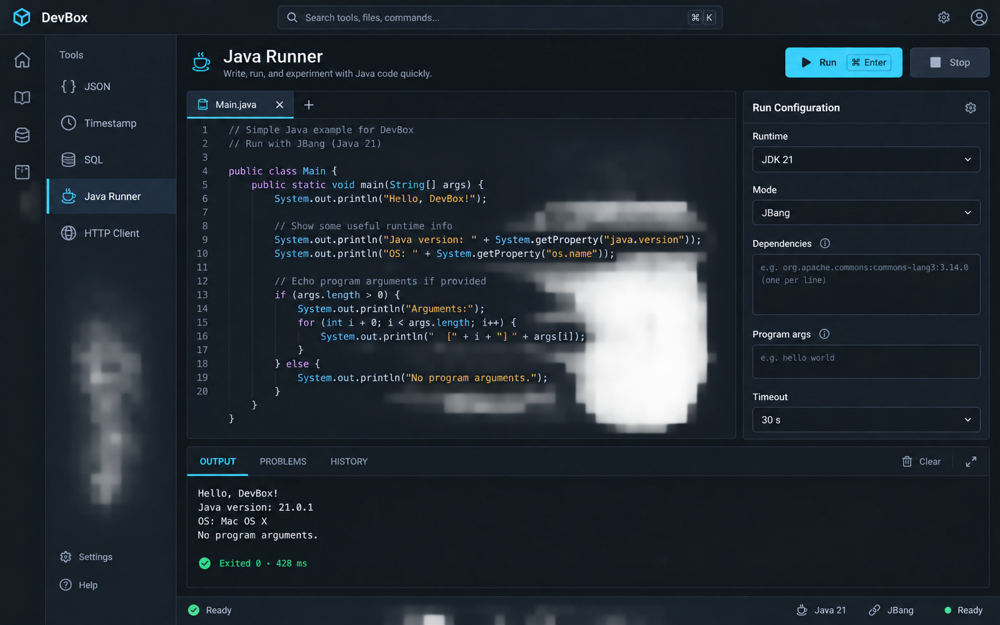
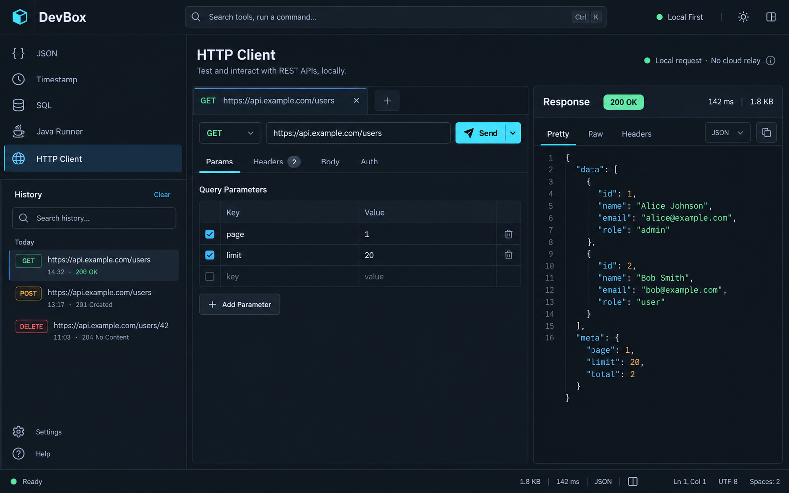

# DevBox 统一界面设计规范

> 依据《DevBox 跨平台个人开发工具箱——技术架构设计》整理。  
> 适用范围：App Shell、五个 MVP 插件、设置、插件权限与运行状态。

## 1. 设计目标

DevBox 的界面应体现“本地优先、快速、可审计、键盘友好”。视觉上保持克制、清晰和高信息密度，不采用装饰性渐变、玻璃拟态或大面积营销卡片。插件可以拥有不同的工作流，但必须共享同一套 Shell、语义色、间距、状态表达和错误处理方式。

核心原则：

1. **工作区优先**：尽可能把垂直空间留给编辑器、输入输出和响应内容。
2. **状态可见**：本地运行、权限、任务状态、耗时、退出码和错误必须在相邻上下文中呈现。
3. **能力可预期**：同类插件使用相同的面板、标签、工具栏和快捷键结构。
4. **风险分级**：普通校验就地展示；后台任务终态进入状态栏/通知；权限和代码执行风险使用持久警示。
5. **跨平台稳定**：使用应用自己的布局与组件，窗口控制区适配 Windows、macOS、Linux，但不改变主要信息架构。

## 2. 统一 App Shell

基准画布为 1440 × 900，窗口缩放后采用弹性布局。

| 区域 | 基准尺寸 | 说明 |
|---|---:|---|
| 顶栏 | 56 px | 品牌、全局搜索/命令入口、全局动作、窗口控制 |
| 图标轨 | 64 px | 首页、工具、历史/收藏、设置等一级入口 |
| 导航侧栏 | 232 px | 插件列表、分组、历史或设置二级导航 |
| 主工作区 | 自适应 | 插件主要内容，最小宽度建议 680 px |
| 右侧检查器 | 300–360 px | 参数、环境、详情；允许折叠 |
| 底部面板 | 180–320 px | 输出、问题、历史；允许拖动和折叠 |
| 状态栏 | 28 px | 本地状态、语言/运行时、编码、任务状态 |

Shell 规则：

- 顶栏始终保留全局搜索/命令入口，默认快捷键为 `Ctrl/Cmd + K`。
- 插件导航只显示名称与 Lucide 图标；选中态使用浅色表面加左侧 2 px 强调线。
- 页面标题区包含标题、单行说明和 1–3 个主动作；主动作始终靠右。
- 面板之间使用 1 px 边界和可拖动分隔线，不用重阴影制造层级。
- 状态栏只显示当前页面相关信息，避免成为第二个工具栏。

## 3. Design Tokens

### 3.1 颜色

| Token | 值 | 用途 |
|---|---|---|
| `--background` | `#0B0F14` | 应用背景 |
| `--surface-1` | `#111821` | 侧栏、面板 |
| `--surface-2` | `#17212C` | 输入框、选中区域、浮层 |
| `--border` | `#263241` | 默认边界与分隔线 |
| `--foreground` | `#E6EDF3` | 主文字 |
| `--muted-foreground` | `#8B98A7` | 次要文字、占位符 |
| `--accent` | `#43C6E8` | 主按钮、焦点、活动标签 |
| `--accent-secondary` | `#8B7CF6` | 次级分类与代码强调 |
| `--success` | `#55D6A7` | 成功、退出码 0、有效状态 |
| `--warning` | `#F2B84B` | 风险提示、等待、部分可用 |
| `--danger` | `#F26D78` | 错误、停止、禁用、删除 |

颜色必须通过语义 token 使用，插件不得硬编码全局品牌色。浅色主题保持相同语义映射，不直接反转所有颜色。

### 3.2 字体与层级

- UI 字体：系统无衬线字体栈，正文 13–14 px，行高 20 px。
- 页面标题：24 px / 32 px，600。
- 区块标题：16 px / 24 px，600。
- 按钮与标签：13–14 px，500–600。
- 代码与结构化数据：系统等宽字体栈，13 px / 20 px。
- 说明文字最多两行；更多内容进入 Tooltip、Popover 或详情页。

### 3.3 间距与形状

- 使用 8 px 间距网格；紧凑控件内部可使用 4 px。
- 页面内边距 20–24 px，面板内边距 16 px，表单行间距 12 px。
- 默认圆角 8 px；小型 badge 为 6 px；不使用全圆角大胶囊按钮。
- 输入和按钮高度 36 px，紧凑工具按钮 28–32 px。
- 焦点环为 2 px `accent`，并与背景保持至少 3:1 对比度。

## 4. 核心组件规则

### 4.1 Toolbar

- 每页最多一个高强调主按钮。
- 危险动作使用描边 `danger`，运行中 `Stop` 才提升可见性。
- Copy、Clear、Wrap 等局部动作放在所属面板标题栏，不放进页面顶栏。
- 快捷键显示在按钮右侧的 `Kbd` 组件中。

### 4.2 Panel 与 Split View

- JSON、SQL、HTTP 等转换/请求类工具优先使用左右分栏。
- 编辑器类工具使用“编辑器 + 检查器 + 底部输出”结构。
- 最小宽度不足 960 px 时，右侧检查器变为抽屉；不足 760 px 时左右面板改为标签切换。
- 分隔比例保存到 session 设置，不写入插件业务数据。

### 4.3 Tabs

- 页面级标签使用下边框活动态；编辑器标签使用顶部文件标签样式。
- 标签顺序固定且可预测：输入配置 → 输出/响应 → 问题 → 历史。
- Badge 只显示数量或短状态，例如 `Headers 2`、`Problems 3`。

### 4.4 Form

- Label 在控件上方；帮助信息使用相邻 info icon。
- 参数数组使用可增删的表格/行编辑器，不使用空格拆分字符串。
- 即时校验错误显示在字段下方，不弹 toast。
- 密钥只展示引用与掩码，永不在普通日志或历史界面显示明文。

### 4.5 Status 与错误

| 类型 | 表达方式 |
|---|---|
| 成功 | 相邻绿色状态、退出码、耗时 |
| 运行中 | 持续状态点/进度、可用 Stop、显示 runId 的详情入口 |
| 用户可修复错误 | 字段或面板内错误，加明确修复动作 |
| 权限错误 | 权限页链接 + 被拒绝的能力名称 |
| 内部错误 | 简短信息 + correlationId + 复制诊断信息 |
| 高风险能力 | 持久 warning callout，不使用一次性 toast |

## 5. MVP 插件页面模板

### JSON Tool

- 左侧 Input、右侧 Output，结构完全对称。
- Format 为主动作；Minify 与 Validate 为次动作。
- 校验结果贴近 Output 标题显示，Copy/Clear/Wrap 分别作用于当前面板。

### Timestamp

- 左侧输入时间戳/当前时间，右侧输出多时区结果。
- 自动识别秒/毫秒，但在结果旁明确显示识别单位。
- “使用当前时间”是次动作，复制动作放在每一行结果末尾。

### SQL Tool

- 沿用 JSON 的左右分栏模板；左侧原始 SQL，右侧格式化结果。
- 方言选择置于标题区次要控件；Format 为唯一主动作。
- 解析错误在对应行显示 marker，并在底部 Problems 标签汇总。

### Java Runner

- 编辑器占主空间，右侧仅放 Runtime、Mode、Dependencies、Args、Timeout。
- Run 为主动作并显示快捷键；运行中禁用 Run、启用 Stop。
- Output / Problems / History 共用底部面板，不在页面中创建多个日志卡片。
- 退出状态必须包含 exit code 与 duration；输出截断时显示固定提示条。

### HTTP Client

- 请求方法、URL、Send 始终在同一行。
- 请求配置使用 Params / Headers / Body / Auth；响应使用 Pretty / Raw / Headers。
- 状态码、耗时、大小在响应标题栏统一呈现。
- 明确显示“本地请求、无云中转”；网络权限或 host 被拒绝时提供权限详情入口。

## 6. 插件与权限设置

- 左侧展示可搜索插件列表与启停状态，右侧展示选中插件的权限、设置和关于信息。
- `Built-in`、版本、发布者与运行状态是不同维度，不混为一个 badge。
- 权限按能力分组，展示“请求内容、授权状态、资源范围”。新增高风险权限默认保持未授权。
- Java Runner 必须常驻展示“代码以当前用户权限运行”的风险提示。
- Disable 与删除/卸载类动作使用危险样式；Save changes 为唯一主动作。

## 7. 键盘与可访问性

- 全局：`Ctrl/Cmd + K` 打开命令面板，`Ctrl/Cmd + ,` 打开设置。
- 页面：`Ctrl/Cmd + Enter` 执行主动作，`Esc` 在编辑器与输出之间切换/关闭浮层。
- 所有图标按钮必须有可访问名称和 Tooltip；状态不能只依赖颜色。
- 文本与背景对比度遵循 WCAG AA；正文不低于 4.5:1。
- 分栏拖动条、标签、树和表格均支持键盘访问。
- 动态 stdout/stderr 使用节流后的 live region，避免逐行打断屏幕阅读器。

## 8. 国际化要求

MVP 必须支持简体中文 `zh-CN` 和英文 `en-US`，设置项提供“跟随系统 / 简体中文 / English”。用户切换语言后，App Shell、已激活插件、命令面板、通知、错误和可访问名称必须立即更新，无需重启。

- React 使用 `i18next + react-i18next`，Core 与各插件使用独立 namespace；翻译资源随安装包本地提供，离线可用。
- 语言优先级为：用户显式设置 → 操作系统语言 → `en-US` fallback。
- 所有用户可见文案使用稳定语义 key；不得以英文原文作为 key，也不得在组件中硬编码中英文。
- Rust/IPC 返回稳定错误码和结构化参数，最终错误文案由 UI 本地化；日志、命令 ID、插件 ID、路径、代码和用户输入不翻译。
- 日期、时间、数字、相对时间和列表使用 `Intl` 按当前 locale 格式化；数据库继续存 UTC 和语言无关数据。
- 文案不得通过字符串拼接生成；使用命名插值参数，以适配不同语序和复数规则。
- 布局为语言变化预留至少 30% 伸缩空间；按钮避免固定文本宽度，说明文字允许换行，表格关键操作不得因文案增长被截断。
- CI 校验 `zh-CN` 与 `en-US` key 集合一致；核心 Playwright 流程和 UI 截图回归必须分别覆盖两种语言。

## 9. React / Tailwind 落地建议

- 在 `packages/ui` 定义 `AppShell`、`ToolSidebar`、`PageHeader`、`SplitPanel`、`CodePanel`、`Inspector`、`BottomPanel`、`StatusBar`、`PermissionRow`。
- Tailwind 只引用语义 token，例如 `bg-background`、`bg-surface-1`、`text-foreground`、`border-border`。
- Monaco 主题由同一份 token 派生；编辑器、输出终端和 JSON 预览共享等宽字体与字号。
- 插件只组合公共组件并提供内容，不修改 Shell 尺寸和全局导航。
- Error Boundary、空状态、加载状态和权限拒绝状态由 Core 提供统一模板。
- 在 `apps/desktop/src/i18n` 初始化语言检测、namespace 和 fallback；插件在激活时注册自身 `zh-CN` / `en-US` 资源。

## 10. 设计图使用说明

这些图片是视觉与布局基准，不是逐像素实现稿。实现时以本规范中的 token、尺寸和交互规则为准；图片中的英文文案必须进入 i18n，并提供对应中文版本。四张图片由内置图像生成工具生成，生成提示以高保真桌面 UI、统一深色主题和文档中的 MVP 功能为约束。
