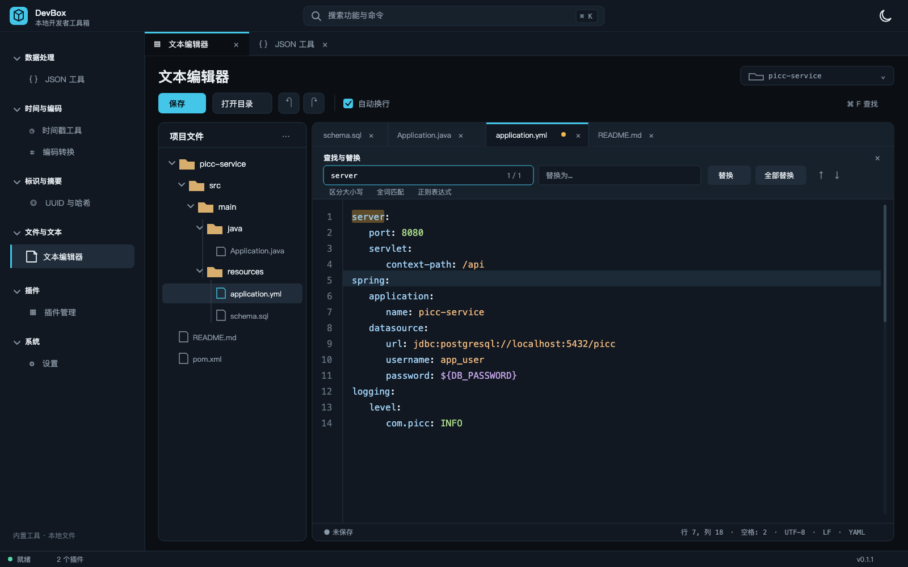

# DevBox 统一界面设计规范

> 依据《DevBox 跨平台开发工具平台——技术架构设计》整理。
>
> 更新日期：2026-09-24
>
> 适用范围：App Shell、内置工具、规划中的轻量文本编辑器、设置、本地 ZIP 插件管理和插件工作区。

## 1. 设计目标

DevBox 的界面应体现“本地优先、快速、克制、可审计”。界面保持高信息密度，不使用装饰性渐变、玻璃拟态或营销式大卡片。

1. **工作区优先**：主要空间用于输入、结果和实际功能。
2. **统一导航**：内置功能和插件都进入同一二级功能树。
3. **统一工作方式**：具体功能在工作区 Tab 中打开，不弹出功能窗口。
4. **状态可见**：插件来源、签名、权限和错误在相邻上下文中呈现。
5. **安全不隐藏**：未签名状态在安装前后持续可见。
6. **跨平台稳定**：主要信息架构不随操作系统改变。

## 2. App Shell

基准画布为 1440 × 900，窗口缩放后采用弹性布局。

| 区域 | 基准尺寸 | 说明 |
|---|---:|---|
| 顶栏 | 56 px | 品牌、全局搜索/命令入口、主题状态 |
| 二级导航 | 240–260 px | 一级功能分类、二级具体功能 |
| Tab 栏 | 36 px | 已打开功能、关闭和排序 |
| 主工作区 | 自适应 | 内置功能、平台页面或插件 child WebView |
| 状态栏 | 28 px | 就绪状态、自定义插件数量和版本 |

Shell 规则：

- 不设置独立图标活动栏，不保留“工具/插件”中间切换按钮。
- 左侧一级菜单为功能大类，二级菜单为具体功能；两级均由注册信息生成。
- 顶栏保留 `Ctrl/Cmd + K` 全局搜索，不提供语言切换按钮。
- 语言切换只在设置页出现。
- 选中功能使用浅色表面和左侧 2 px 强调线。
- 窄于 760 px 时侧栏可隐藏，主工作区保持可用。

## 3. 功能树

- 一级分类可展开/折叠，默认展开内置分类。
- 二级项显示 Lucide 图标和本地化名称，不显示来源标签。
- 分类按 `category.order` 排序，功能按 `view.order` 排序。
- 内置分类标题使用平台 i18n key；插件分类必须在 manifest 中提供中文和英文标题。
- 点击二级项时打开或激活对应 Tab；同一功能不会创建重复 Tab。
- 禁用或卸载插件时，其导航项和已打开 Tab 同步移除。

## 4. Tab 工作区

- 允许同时打开多个功能 Tab。
- 每个功能在一个会话中最多一个 Tab；再次点击只激活已有 Tab。
- 每个 Tab 显示功能图标、标题和关闭按钮。
- Tab 支持鼠标拖动重新排序，并支持键盘聚焦和关闭。
- 右键 Tab 显示平台菜单：关闭当前、关闭所有、关闭右侧、关闭其他；不可执行项置灰。
- 关闭当前 Tab 后激活相邻项；全部关闭后展示空工作区指引。
- 内置功能面板在 Tab 切换后保留当前会话输入。
- 插件以附属 child WebView 覆盖在活动面板内；非活动时隐藏，关闭时销毁。
- 主程序打开右键菜单、命令面板或其他浮层时，暂停显示活动插件 child WebView；浮层关闭后恢复。主程序 DOM 的 `z-index` 不用于跨原生 WebView 层级。
- 不持久化 Tab 列表、顺序或输入，重启始终进入默认内置功能。

## 5. Design Tokens

### 5.1 颜色

| Token | 深色值 | 用途 |
|---|---|---|
| `--bg-canvas` | `#0B0F14` | 应用背景 |
| `--bg-surface` | `#111821` | 侧栏、面板 |
| `--bg-elevated` | `#17212C` | 输入框、选中区域、浮层 |
| `--border` | `#263241` | 边界与分隔线 |
| `--text` | `#E8EDF2` | 主文字 |
| `--text-muted` | `#8B98A7` | 次要文字、占位符 |
| `--accent` | `#43C6E8` | 主按钮、焦点、活动标签 |
| `--success` | `#55D6A7` | 成功、已验证 |
| `--warning` | `#F2B84B` | 未签名、权限变化 |
| `--danger` | `#EF6A78` | 无效签名、删除、阻塞错误 |
| `--scrollbar-track` | `#111821` | 滚动条轨道 |
| `--scrollbar-thumb` | `#344555` | 滚动条滑块 |
| `--scrollbar-thumb-hover` | `#506577` | 滚动条悬停 |

浅色主题保持相同语义映射。插件不得修改 Shell token 或硬编码全局品牌色。主程序和插件均引入同版本 `@devbox/ui/styles.css`，其中包含主题 token、通用按钮、页面宽度和滚动条样式。

滚动条宽度统一为 9 px，深浅主题均使用对应 token。工作区、文本输入、代码编辑器和插件内部滚动区域不得显示 WebView2 默认浅色滚动条；Tab 栏滚动条可隐藏，但必须保留滚轮与键盘可达性。

### 5.2 字体、间距和形状

- UI 使用系统无衬线字体，正文 13–14 px / 20 px。
- 页面标题 28–40 px，区块标题 16 px；JSON、编码结果和摘要使用等宽字体。
- 使用 8 px 间距网格，紧凑控件内部可使用 4 px。
- 页面内边距 24–32 px，面板内边距 16–22 px。
- 默认圆角 8–10 px；输入和按钮高度 36 px。
- 焦点环为 2 px `accent`，正文对比度符合 WCAG AA。

## 6. 公共组件与页面布局规则

### 6.1 功能页骨架

内置工具、平台页面和插件功能页采用相同的纵向信息结构，不得为单个功能随意改变区块顺序：

1. 页面标题区：仅保留标题；必要时可在右侧放置运行环境或状态信息，不显示分类路径、eyebrow 或重复说明。
2. 页面操作栏：页面级操作和影响处理方式的选项。
3. 行内反馈区：校验、成功、警告或可修复错误；无内容时不占高度。
4. 主内容区：输入、配置、结果或记录。

统一尺寸与间距：

- 页面使用明确的宽度类型：`fluid` 用于编辑器、双栏输入/输出和其他工作台，横向填满工作区；`form` 用于设置、插件管理和紧凑表单，最大内容宽度 1180 px；`prose` 用于较长说明，最大内容宽度 880 px。不得给所有功能页统一设置 1180 px 上限。
- `fluid` 页面左右安全边距为 24 px，宽屏可增加到 32 px；窄窗口缩小到 14 px。所有宽度类型保持内容左边界一致，不通过单页额外 margin 补偿。
- 页面顶部和底部内边距分别为 32 px 和 24 px。
- 标题区与操作栏间距为 20 px；操作栏与主内容区间距为 14 px；行内反馈出现时使用 8–12 px 垂直间距。
- 页面标题区、操作栏和主内容区使用同一左边界，不得通过临时 margin 修正单个控件位置。
- 页面右侧状态信息不得挤压标题和说明；空间不足时换到标题下方。
- 工作区高度由标题区、操作栏和主内容区共同占满；输入、编辑、输出类主内容区使用剩余高度，不设置导致全屏底部大面积留白的固定高度。
- 页面级滚动只用于内容确实超出可用空间的表单页；编辑器和双栏输入输出页由面板内部滚动，不产生窗口级横向滚动条。

### 6.2 页面操作栏

操作栏必须按语义分组，按钮与选项不得交叉排列。标准顺序为：

`[主要操作] [次要操作] [清空/重置] | [选项 1] [选项 2]`

具体规则：

- 每页最多一个高强调主按钮，且始终位于操作栏最左侧。
- 与主任务直接相关的次要操作紧随主按钮，使用普通按钮样式。
- 清空或重置整个页面输入、结果与状态时，属于页面级操作，必须紧随其他操作按钮，不得被复选框、选择器或说明文字隔开。
- 页面级 Clear/Reset 默认使用 ghost 或普通次要样式；只有会删除持久化数据或产生难以恢复的影响时才使用 danger 语义和确认步骤。
- 影响处理方式的复选框、单选框和选择器组成选项组，统一放在按钮组之后；按钮组与选项组之间使用 16 px 间距或 1 px 分隔线，组内间距为 8 px。
- 禁止依靠单个控件的 `margin-left`、空白占位元素或不同 gap 制造分组；分组必须由明确的容器表达。
- 窄窗口允许操作栏换行，但按钮组和选项组各自保持内部顺序；选项组整体换到下一行，不得插入按钮组中间。
- 页面级标准动作使用“图标 + 文字”，包括 Format、Compact、Run、Extract、Convert、Generate、Copy、Clear；图标取自同一动作组件，不由各功能页自行选择。模式切换和字段选项使用纯文字。面板内允许纯图标按钮，但必须有可访问名称，常用动作优先显示文字。
- 按钮高度、圆角、边框、禁用和悬停状态由共享 `Button`、`ActionButton`、`IconButton` 定义；插件不得另写同义按钮样式。
- 中英文切换后允许控件自然伸缩，不设置依赖中文长度的固定宽度；操作栏至少预留 30% 文案扩展空间。

作用域规则：

- 同时影响多个面板或整个功能状态的操作放在页面操作栏，例如 JSON 的 Format、Compact、Clear。
- 只影响一个面板的操作放在该面板标题栏，例如 Result 的 Copy、单个历史列表的 Clear history。
- Wrap、Sort keys 等改变处理或显示方式的控件属于选项组，不得放在两个操作按钮之间。

### 6.3 表单

- Label 位于控件上方；同一行的紧凑开关或复选框可使用右侧文字。
- 即时错误显示在字段或面板内，不弹 toast。
- 危险动作使用 danger 语义；禁用与卸载必须明确区分。

### 6.4 Panel 与结果

- JSON、Encoding 优先左右分栏；窄窗口改为纵向排列。
- Timestamp 使用输入配置和逐行结果结构。
- UUID/Hash 使用内部模式切换，不创建新的工作区 Tab。
- 错误不得清空上一次有效结果，除非用户主动 Clear。
- 所有文本结果面板在标题栏提供 Copy；空结果禁用，复制成功后显示短暂反馈。多路输出应按当前显示顺序合并复制。页面级 Clear 与结果面板局部 Clear 的作用域必须明确。

### 6.5 状态表达

| 类型 | 表达方式 |
|---|---|
| 成功 | 相邻绿色状态、版本和来源 |
| 用户可修复错误 | 字段或面板内错误，加明确修复动作 |
| 权限错误 | 权限名称和处理说明 |
| 内部错误 | 简短信息、correlationId、复制诊断 |
| 未签名插件 | 持久 warning callout 与 badge |
| 无效签名 | 红色阻塞状态，禁止安装 |

## 7. 内置工具

### 7.1 JSON

- 左侧 Input、右侧 Result，结构对称。
- 操作栏固定为 `Format → Compact → Clear | Sort keys → Wrap`；三个按钮属于连续的页面操作组，两个复选框属于连续的选项组。
- Format 为唯一主动作，Compact 为普通次要动作，Clear 为 ghost 次要动作。
- Copy 只影响 Result，放在 Result 面板标题栏；Clear 同时清空 Input、Result 和页面状态，因此不得放在单个面板标题栏。
- 显示 UTF-8 输入大小；上限 2 MiB。
- 解析失败显示行列位置，并保留上一次有效结果。

### 7.2 Timestamp

- 输入支持秒、毫秒和日期文本，结果明确显示秒、毫秒、ISO、本地时间和目标时区。
- 时区使用 IANA 名称；“使用当前时间”为次动作。
- 每一行结果提供复制动作。

### 7.3 Encoding

- 使用 Base64、URL、UTF-8 Hex 模式和 Encode/Decode 方向选择。
- 沿用左右输入/结果结构，提供交换、清空和复制。
- 非法 Base64、URL 转义、Hex 或 UTF-8 显示行内错误。

### 7.4 UUID/Hash

- 页面内部使用 UUID v4 与 Hash 两种模式。
- UUID 支持 1–1000 个批量生成和复制全部。
- Hash 支持 SHA-256、SHA-384、SHA-512，以及 Hex/Base64 输出。
- 常驻显示字符数、UTF-8 字节数和“摘要不是加密”的说明。

四个工具都是平台基础功能，不显示插件来源、签名、权限、安装或卸载操作。

### 7.5 轻量文本编辑器（规划，尚未实现）

文本编辑器作为 `dev-box` 的平台内置功能，位于新增一级分类“文件与文本”下，二级项为“文本编辑器”，图标使用文件/文本语义图标。它只处理用户主动选择的本地目录及其中的文本文件，不向 ZIP 插件开放目录访问能力，也不提供代码执行、工程编译或 IDE 级索引。与其他功能一样，编辑器在外层工作区只占一个 Tab；内部文件标签用于区分当前目录下已打开的文件。

设计图中的目录和内容仅用于说明布局，实际首次打开时为空，不预置目录、文件或示例文本。可编辑 SVG 源文件为 [`devbox-ui-text-editor.svg`](./devbox-ui-text-editor.svg)。

#### 7.5.1 布局与视觉

- 使用 `fluid` 页面宽度。保留 Shell 功能树和外层 Tab；页面上方为“文本编辑器”标题与当前目录名称，随后是页面操作栏，主区域为“目录树 | 编辑区”。不显示面包屑或重复介绍文字。
- 基准画布为 1600 × 1000。目录树默认宽 260 px，可拖动调整，范围 220–400 px；编辑区占据剩余宽度。标题、操作栏、文件树和编辑器左边界遵循本规范第 6 节的间距与按钮规则。
- 主区域填满标题和操作栏之外的可用高度；目录树和文本内容独立滚动，窗口本身不出现横向滚动条。文件标签过多时在标签条内部滚动，使用与 Shell 相同的滚动条语义色。
- 工作区宽度不足 900 px 时目录树可收起为侧边抽屉，编辑区优先占满空间；低于 760 px 时继续沿用 Shell 可隐藏导航规则。收起目录树不得关闭已打开文件。
- 内层文件标签与外层功能 Tab 通过位置和层级区分：外层切换功能，内层切换文件。当前文件显示活动线；未保存文件显示文字旁状态点，不能只靠颜色传达。

#### 7.5.2 打开目录与文件树

- 未选择目录时，主区域只显示“打开目录”主按钮与简短空状态。点击后调用系统目录选择器；取消选择保持原状态，不显示错误。
- 已打开目录时，“保存”为当前有未保存修改时的主要操作，“打开目录”为次要操作；撤销、重做与自动换行按图中顺序排列。无修改时保存禁用。打开另一目录、关闭编辑器外层 Tab 或退出应用时，若有未保存文件，先明确提供“保存 / 不保存 / 取消”。
- 树根显示用户所选目录名称，目录可展开/折叠；首次只加载根目录，展开时再加载子目录。默认文件夹在前、文件在后，按自然名称排序。选中文件使用浅色表面与左侧强调线。
- 默认显示常规文件；树标题栏更多菜单可切换显示隐藏文件。符号链接显示标识但首版不跟随，避免跨出用户所选目录。读取失败的节点显示行内错误与重试，不使整棵树消失。
- 点击文件打开或激活对应的内层文件标签；同一文件只打开一次。目录树仅负责浏览，不在首版提供新建、重命名、移动、删除或项目范围全文搜索。

#### 7.5.3 编辑区与格式支持

- 编辑区从上到下为文件标签、按需出现的查找/替换栏、带行号的正文、状态栏。文件标签可关闭和拖动排序；切换文件保留未保存内容。关闭有修改的文件前需确认。
- 按扩展名（不区分大小写）选择高亮语言：`.sql`、`.md`/`.markdown`、`.java`、`.json`、`.xml`、`.yaml`/`.yml`、`.properties` 必须支持；同时支持常见的 `.js`/`.ts`、`.html`、`.css`、`.sh`、`.toml`、`.txt`、`.log`。未知文本以 Plain Text 打开，不将其误判为 JSON 或代码。状态栏显示当前语言。
- 高亮只影响显示，不改写源文件；遵循深浅主题的语义色，并对关键字、字符串、数字、注释和查找命中保持可辨识对比度。Markdown 首版为源码高亮，不提供实时预览；SQL 只高亮，不包含 SQL Formatter 或数据库连接。
- 支持输入、选择、剪切/复制/粘贴、撤销/重做、自动缩进、缩进/取消缩进、行号、当前行高亮、自动换行和跳转行。状态栏显示行列、缩进宽度、编码、换行符、语言与未保存状态。
- 首版以 UTF-8（含 BOM 检测）读写，保存时保留原文件的 BOM 与 LF/CRLF 换行风格，不静默转换。无法按支持编码解码或判定为二进制的文件不进入可编辑状态，显示简短原因。单文件不超过 5 MiB 可编辑；5–20 MiB 只读预览；超过 20 MiB 不载入并显示大小限制。
- 保存仅由用户触发，使用原路径安全写入，不自动上传或同步。保存前若检测到磁盘文件已被外部修改，提供“重新载入 / 覆盖保存 / 取消”，不得静默覆盖。只读或保存失败时保留缓冲区内容与未保存标记。

#### 7.5.4 查找与替换

- `Ctrl/Cmd + F` 打开当前文件查找，`Ctrl/Cmd + H` 打开当前文件查找与替换；快捷键提示按操作系统显示。`Esc` 关闭查找栏并将焦点交还编辑器。
- 查找栏显示查询框、当前命中序号/总数、上一处/下一处，以及区分大小写、全词匹配、正则表达式选项。命中位置在文本中高亮，当前命中更醒目；无命中时显示 `0 / 0`，无效正则显示行内错误。
- 替换栏提供替换文本、替换当前、全部替换；空查询不允许执行替换。全部替换先计算目标数量并作为一次可撤销编辑写入当前缓冲区，不跨文件，不自动保存。
- 查找、替换仅作用于当前内层文件标签；切换文件后查询条件可保留，但命中数量按新文件重新计算。项目范围查找/替换不在首版范围。

#### 7.5.5 权限、状态与验收

- 本功能由主程序处理目录选择与受控文件读写；授权范围仅为本次用户所选目录，符号链接不得绕过范围。目录路径不传给插件，不访问网络。重启后不恢复目录或文件标签，符合第 4 节会话规则。
- 文案使用平台 `zh-CN`/`en-US` 资源；文件名与路径原样显示并在空间不足时省略中段，悬停和键盘聚焦时可查看完整路径。目录树、文件标签、编辑区和查找栏均可键盘到达，并具备可访问名称。
- 验收覆盖 Windows/macOS 的打开目录、嵌套树、扩展名高亮、查找/替换、未保存关闭确认、外部修改冲突、只读/二进制/大文件状态、窄窗口与全屏尺寸、深浅主题和中英文。设计图不代表这些能力已经实现。

## 8. 插件管理与本地安装

### 8.1 信息架构

插件管理只有两个页签：

- `Installed`：自定义插件、启停、打开、回退、卸载和签名状态。
- `Add ZIP Plugin`：选择本地 ZIP、预检、安全确认和安装。

不得显示 Online、Catalog、Updates 或开发者模式入口。

### 8.2 选择与预检

- 文件选择器只展示 `.zip`。
- 选择后先执行预检，不立即安装。
- 确认界面展示名称、ID、版本、发布者、自述权限、包 SHA-256、兼容性和安装/更新类型。
- 未签名包使用 warning 图标和醒目说明：“无法验证发布者与内容完整性，仅安装来自可信来源的 ZIP”。
- 路径非法、超限、不兼容、签名不完整或签名无效时阻止安装。

### 8.3 已安装插件

- 每行显示图标、名称、发布者、版本、来源和状态。
- 未签名插件持续显示 `Unsigned` danger/warning badge。
- Open 在工作区创建或激活插件 Tab，不打开独立窗口。
- Disable 会移除导航项并关闭关联 Tab；Uninstall 可选择保留或删除插件数据。
- 不提供“信任此发布者并不再提醒”。

## 9. 国际化

MVP 支持简体中文 `zh-CN` 和英文 `en-US`。设置页提供“跟随系统 / 简体中文 / English”。

- 语言切换控件只出现在设置页。
- 切换后 Shell、功能树、Tab、内置工具、插件管理、错误和可访问名称立即更新。
- 平台文案使用稳定语义 key，不以英文原文作为 key。
- Rust/IPC 返回错误码与结构化参数，最终文案由 UI 本地化。
- 日期、数字、大小使用 `Intl`；布局为翻译预留至少 30% 伸缩空间。
- 插件分类标题必须同时提供 `zh-CN` 和 `en-US`；插件资源随 ZIP 离线安装。
- CI 校验中英文 key 一致。

## 10. 键盘与可访问性

- `Ctrl/Cmd + K` 打开命令面板；`Esc` 关闭浮层。提示文字按当前操作系统显示：macOS 为 `⌘ K`，Windows/Linux 为 `Ctrl K`，不得硬编码平台符号。
- 功能树、Tab、关闭按钮、表单和插件安装确认均支持键盘操作。
- 所有图标按钮具有可访问名称，状态不能只依赖颜色。
- 安装确认打开时焦点进入对话框，关闭后返回触发按钮。
- 分类展开状态、活动 Tab 和选中功能通过语义属性暴露。

## 11. 共享实现与验收边界

- `@devbox/ui` 是主程序和插件共用的界面包，提供语义色、滚动条、宽度类型、标准动作按钮、复制按钮和快捷键提示。插件仓库在独立发布前使用同版本的本地快照，并通过同步脚本从主程序仓库更新；后续可改为包仓库分发。
- 新功能先选择页面宽度类型，再复用按钮和结果面板交互。评审时检查中英文、Windows/macOS 快捷键、全屏宽度、长文本滚动和活动插件上的浮层。
- 浏览器自动化负责布局、语义和交互；原生 child WebView 遮挡与 Windows WebView2 滚动条需要在后续跨平台实机验收中确认。

## 12. 设计图使用说明

`devbox-ui-json-tool.png` 继续作为工具页面视觉基准，`devbox-ui-text-editor.png` 是规划中文本编辑器的布局与交互参考，`devbox-ui-plugin-permissions.png` 仅作为插件安全信息布局参考。原 Java Runner、HTTP Client 和在线插件市场图片不再作为 MVP 验收依据。实现以本文的二级功能树、多 Tab、本地 ZIP 和设置页语言入口为准。
